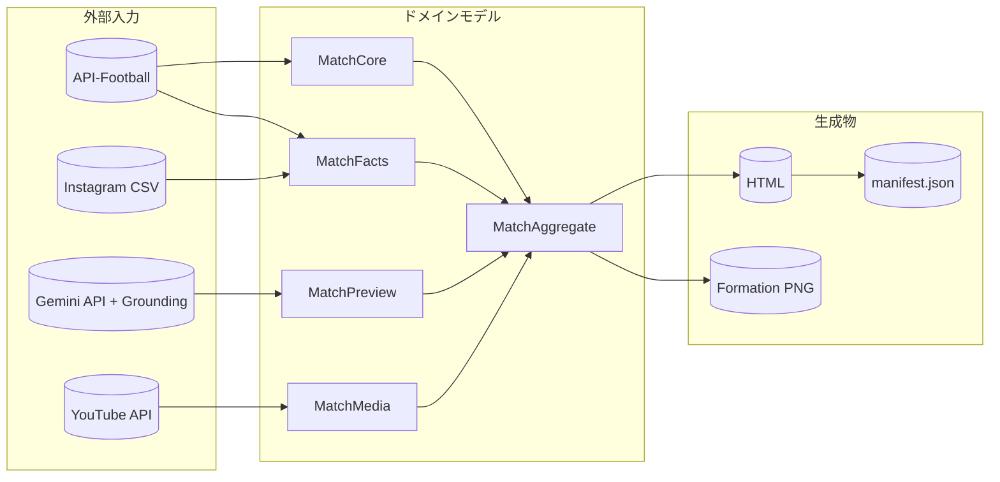
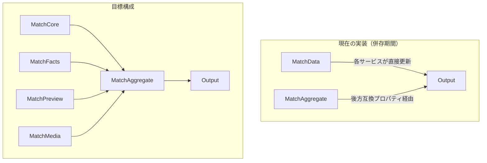

# データモデル設計

本ドキュメントは、システム全体のデータ構造と責務境界を定義する。

関連ドキュメント:
- [domain_models.md](./domain_models.md) - ドメインモデル概要
- [implementation_flow.md](./implementation_flow.md) - データフロー詳細

---

## 1. データ境界概要



---

## 2. ドメインモデル構成

### 2.1 モデル一覧

| クラス | 責務 | 生成元 | データ例 |
|-------|------|--------|---------|
| `MatchCore` | 試合基本情報（不変） | MatchProcessor | id, home_team, away_team, kickoff_* |
| `MatchFacts` | API取得データ | FactsService | lineup, formation, injuries, player_* |
| `MatchPreview` | LLM生成データ | NewsService | news_summary, tactical_preview |
| `MatchMedia` | メディアデータ | YouTubeService | youtube_videos, formation_image |
| `MatchAggregate` | 統合コンテナ | Workflow | 上記4つを集約 |
| `MatchData` | 後方互換クラス | - | **将来削除予定** |

### 2.2 現在の状態（併存期間）



> [!NOTE]
> 現在は `MatchData` と `MatchAggregate` が併存しています。
> 段階的移行完了後、`MatchData` は削除予定です（Issue #100）。

---

## 3. フィールド責務マトリクス

### 3.1 更新責務（どのサービスがどのフィールドを設定するか）

| フィールドカテゴリ | フィールド例 | 更新サービス | 読み取りサービス |
|------------------|-------------|-------------|----------------|
| 試合基本情報 | `id`, `home_team`, `kickoff_*` | MatchProcessor | 全サービス |
| 選手リスト | `*_lineup`, `*_bench` | FactsService | ReportGenerator |
| 選手詳細 | `player_*` | FactsService | ReportGenerator |
| 監督情報 | `*_manager`, `*_manager_photo` | FactsService | ReportGenerator |
| フォーム・対戦 | `h2h_summary`, `h2h_details`, `home_recent_form_details`, `away_recent_form_details` | FactsService | ReportGenerator |
| 怪我人情報 | `injuries_*` | FactsService | ReportGenerator |
| ニュース要約 | `news_summary` | NewsService | ReportGenerator |
| 戦術プレビュー | `tactical_preview` | NewsService | ReportGenerator |
| インタビュー | `*_interview` | NewsService | ReportGenerator |
| 動画リスト | `youtube_videos` | YouTubeService | ReportGenerator |
| エラー状態 | `error_status` | 各サービス | Workflow |

### 3.2 データソース対応

| 外部データソース | 取得フィールド | キャッシュTTL |
|----------------|--------------|-------------|
| API-Football `/fixtures` | 試合基本情報 | 1時間 |
| API-Football `/fixtures/lineups` | スタメン・フォーメーション | 30分 |
| API-Football `/players` | 選手詳細情報 | 24時間 |
| API-Football `/injuries` | 怪我人情報 | 1時間 |
| API-Football `/fixtures/headtohead` | 対戦成績 | 24時間 |
| Gemini API (Grounding) | 要約テキスト, ニュース取得 | キャッシュなし |
| YouTube Data API | 動画リスト | 24時間 |
| Instagram CSV | Instagramリンク | ファイル読込 |

---

## 4. 生成物スキーマ

### 4.1 出力ファイル一覧

| 生成物 | 形式 | 保存先 | 生成元 |
|-------|------|--------|--------|
| HTMLレポート | HTML | `public/reports/*.html` | HtmlGenerator |
| フォーメーション画像 | PNG | `public/reports/images/` | ReportGenerator |
| レポート一覧 | JSON | `public/reports/manifest.json` | HtmlGenerator |

### 4.2 manifest.json 構造

```json
{
  "reports": [
    {
      "filename": "2025-12-27_ManchesterCity_vs_Arsenal_20251228_071500.html",
      "title": "[DEBUG] Manchester City vs Arsenal - EPL",
      "date": "2025-12-28T07:15:00+09:00",
      "match_date": "2025-12-27"
    }
  ],
  "generated_at": "2025-12-28T07:15:00+09:00"
}
```

---

## 5. 選手・監督データ（将来拡張）

### 5.1 現在のデータ構造

選手情報は `MatchData.player_*` の辞書として管理:

```python
player_nationalities: Dict[str, str]  # {"Erling Haaland": "Norway"}
player_numbers: Dict[str, int]        # {"Erling Haaland": 9}
player_photos: Dict[str, str]         # {"Erling Haaland": "https://..."}
player_birthdates: Dict[str, str]     # {"Erling Haaland": "2000-07-21"}
player_positions: Dict[str, str]      # {"Erling Haaland": "F"}
player_instagram: Dict[str, str]      # {"Erling Haaland": "https://instagram.com/..."}
```

### 5.2 将来の拡張候補

| データ種別 | 現在 | 将来案 |
|-----------|------|--------|
| 選手マスタ | 試合ごとに取得 | 永続化キャッシュ |
| 監督情報 | 基本情報のみ | キャリア・戦績 |
| チーム情報 | ロゴのみ | スタジアム・歴史 |
| 統計データ | なし | シーズン成績 |

> [!TIP]
> 選手・監督データを拡充する場合は、`Player` / `Manager` クラスを
> 独立したエンティティとして定義することを推奨します。

---

## 6. 関連Issue

- Issue #100: MatchAggregate への段階的移行
- Issue #91: データ境界設計（本ドキュメントで対応）
