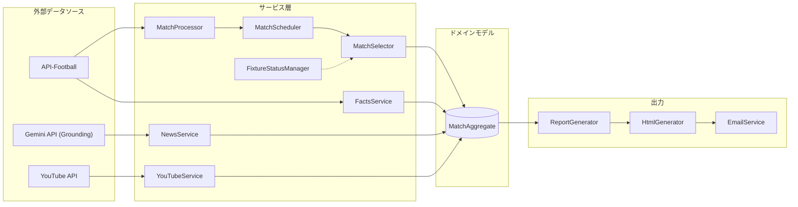
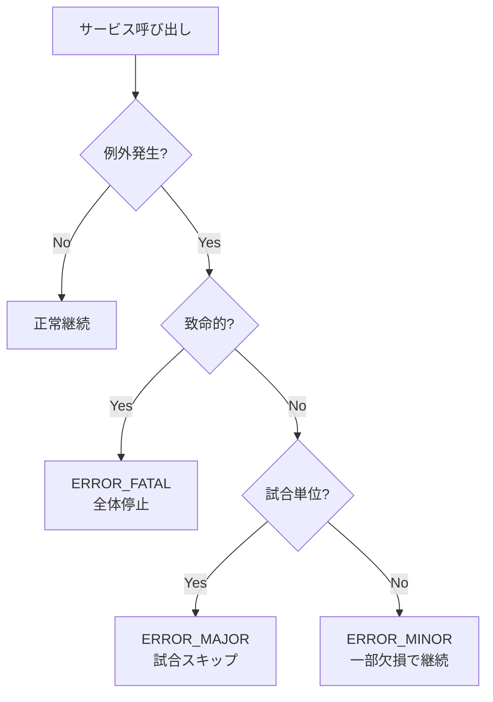

# 実装フロー設計

本ドキュメントは、システム全体設計 ([system_overview.md](./system_overview.md)) を補完し、各コンポーネント間の詳細なデータフローと責務境界を定義する。

---

## 1. ワークフロー全体像

メインのエントリーポイントは `GenerateGuideWorkflow.run()` であり、以下のステップを順次実行する。

```mermaid
graph TD
    subgraph Workflow["GenerateGuideWorkflow.run()"]
        A[MatchProcessor.run] --> B[MatchScheduler + FixtureStatusManager<br/>(prod only)]
        B --> C[MatchSelector.select]
        C --> D[FactsService.enrich_matches]
        D --> E[NewsService.process_news]
        E --> F[YouTubeService.fetch_videos]
        F --> G[ReportGenerator.generate_all]
        G --> H[HtmlGenerator.generate]
        H --> I[EmailService.send]
    end
    
    H[main.py] --> Workflow
    Workflow --> J[CacheWarmer.run]
```

> 補足: `MatchScheduler` / `FixtureStatusManager` は **本番のみ**で有効。デバッグ/モックではスキップされ、`MatchSelector.select()` が直接適用される。

---

## 2. コンポーネント責務

各サービスの入力・出力・副作用を明確にする。

### 2.1 MatchProcessor

| 項目 | 内容 |
|------|------|
| **責務** | 試合データ取得、ランク付け（選定はWorkflow側） |
| **入力** | `config.TARGET_DATE`, `config.TARGET_LEAGUES` |
| **出力** | `List[MatchAggregate]` (選定前) |
| **依存クライアント** | `ApiFootballClient` |
| **副作用** | なし |

**内部フロー:**
1. `extract_matches()`: API-Footballから試合リスト取得
2. `MatchRanker.assign_rank()`: 各試合にランク付与

### 2.1.1 Selection & Scheduling（Workflow内）

| 項目 | 内容 |
|------|------|
| **責務** | 時間窓フィルタと処理済み管理による対象試合抽出 |
| **入力** | `List[MatchAggregate]` |
| **出力** | `List[MatchAggregate]` (is_target付与) |
| **依存クライアント** | `FixtureStatusManager` (GCS) |
| **副作用** | 本番のみステータス更新（processing/complete/failed） |

**内部フロー:**
1. `MatchScheduler.filter_processable_matches()`: 時間窓チェック
2. `MatchSelector.select()`: ランク順に上位試合を選定（is_target付与）
3. `FixtureStatusManager`: 処理開始/完了/失敗の状態管理（本番のみ）

---

### 2.2 FactsService

| 項目 | 内容 |
|------|------|
| **責務** | 試合詳細情報（スタメン、怪我人、フォーム、対戦履歴）の付加 |
| **入力** | `List[MatchAggregate]` |
| **出力** | `List[MatchAggregate]` (enriched) |
| **依存クライアント** | `ApiFootballClient` |
| **副作用** | `MatchAggregate`のフィールド更新（in-place mutation） |

**更新されるフィールド:**
- `home_lineup`, `away_lineup`: スタメン情報
- `home_formation`, `away_formation`: フォーメーション
- `injuries`: 怪我人情報
- `home_form`, `away_form`: 直近フォーム
- `h2h`: 対戦履歴

---

### 2.3 NewsService

| 項目 | 内容 |
|------|------|
| **責務** | ニュース収集、LLM要約、スポイラーフィルタリング |
| **入力** | `List[MatchAggregate]` |
| **出力** | `List[MatchAggregate]` (news fields populated) |
| **依存クライアント** | `GeminiRestClient` (Grounding), `LLMClient` |
| **副作用** | `MatchAggregate`のフィールド更新（in-place mutation） |

**更新されるフィールド:**
- `news_summary`: ニュース要約（スポイラーフィルタ済み）
- `tactical_preview`: 戦術プレビュー
- `home_interview`, `away_interview`: インタビュー要約

**スポイラーフィルタリング:**
1. `SpoilerFilter.is_safe_article()`: 記事収集時のルールベースフィルタ
2. `LLMClient.check_spoiler()`: LLMによる要約後のセカンドチェック

詳細は [common.md](../03_components/gemini_tasks/common.md) を参照。

---

### 2.4 YouTubeService

| 項目 | 内容 |
|------|------|
| **責務** | YouTube動画検索、優先度ソート、フィルタリング |
| **入力** | `List[MatchAggregate]` |
| **出力** | `Dict[str, List[Dict]]` (動画リスト) |
| **依存クライアント** | YouTube Data API (via `YouTubeSearchClient`) |
| **副作用** | ローカルキャッシュへの書き込み |

**動画カテゴリ:**
- 記者会見 (`press_conference`)
- 過去の名勝負 (`historic_clashes`)
- 戦術解説 (`tactical`)
- 選手紹介 (`player_highlight`)
- 練習風景 (`training`)

詳細は [01_requirements/youtube_integration.md](../01_requirements/youtube_integration.md) を参照。

---

### 2.5 ReportGenerator

| 項目 | 内容 |
|------|------|
| **責務** | Markdownレポート生成、フォーメーション画像生成 |
| **入力** | `List[MatchAggregate]`, YouTube動画リスト |
| **出力** | `List[Dict]` (各試合のMarkdown+画像パス) |
| **副作用** | フォーメーション画像ファイル生成 |

---

### 2.6 HtmlGenerator

| 項目 | 内容 |
|------|------|
| **責務** | Markdown → HTML変換、manifest更新、Firebase同期 |
| **入力** | Markdownレポートリスト |
| **出力** | HTMLファイル、manifest.json |
| **副作用** | `public/reports/`への書き込み |

---

### 2.7 EmailService

| 項目 | 内容 |
|------|------|
| **責務** | デバッグサマリメール送信 |
| **入力** | 処理結果サマリ |
| **出力** | なし |
| **副作用** | メール送信 (Gmail API) |

---

## 3. データフロー図



---

## 4. エラーハンドリングフロー

各コンポーネントでのエラーハンドリング方針は [non_functional.md](../01_requirements/non_functional.md) に定義されている。

| レベル | 挙動 |
|--------|------|
| `ERROR_NONE` | 正常終了 |
| `ERROR_MINOR` | 一部データ欠損、処理継続 |
| `ERROR_MAJOR` | 試合スキップ、他の試合は処理継続 |
| `ERROR_FATAL` | 全体停止 |



---

## 5. 関連ドキュメント

- [システム全体設計](./system_overview.md) - アーキテクチャ概要
- [外部API連携設計](./external_apis.md) - API呼び出し仕様
- [キャッシュ設計](./cache.md) - キャッシュ戦略
- [LLM制約仕様](../03_components/gemini_tasks/common.md) - LLM入出力制約
- [非機能要件](../01_requirements/non_functional.md) - エラーハンドリング方針
