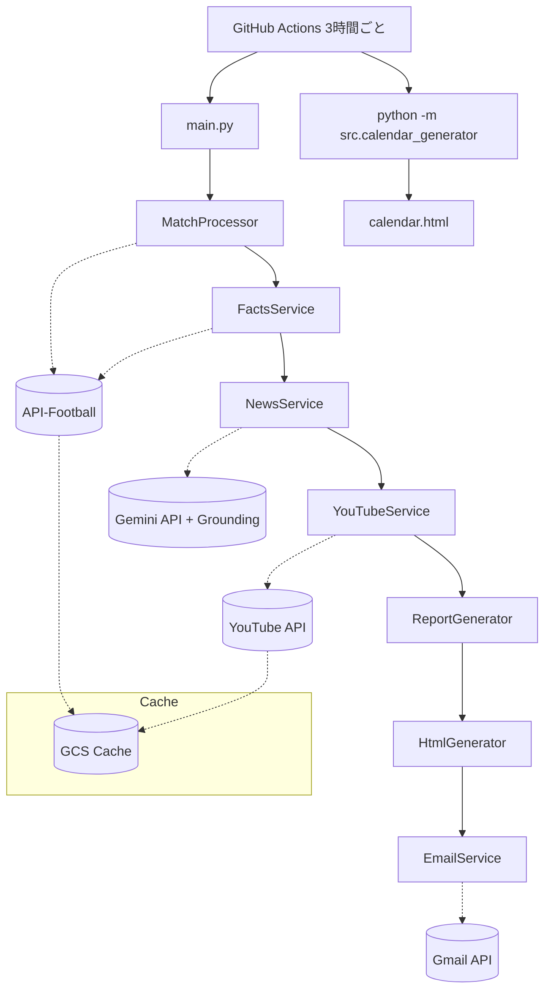

# システム全体設計

機能要件 ([01_requirements/index.md](../01_requirements/index.md)) を実現するためのシステム全体設計。

---

## 1. システム概要

サッカーの未視聴試合を、スコアや結果を知ることなく観戦するための「ネタバレ回避観戦ガイド」を自動生成するシステム。

- 実行タイミング：3時間ごと (JST基準運用)
- 出力形式：HTMLレポート、カレンダーHTML（Firebase Hosting）、メール

---

## 2. アーキテクチャ構成

```mermaid
graph TD
    A[GitHub Actions 3時間ごと] --> B[main.py]
    A --> B2[python -m src.calendar_generator]
    B --> C[MatchProcessor]
    C --> D[FactsService]
    D --> E[NewsService]
    E --> F[YouTubeService]
    F --> G[ReportGenerator]
    G --> H[HtmlGenerator]
    H --> I[EmailService]
    B2 --> Q[calendar.html]
    
    C -.-> J[(API-Football)]
    D -.-> J
    E -.-> L[(Gemini API + Grounding)]
    F -.-> M[(YouTube API)]
    I -.-> N[(Gmail API)]
    
    subgraph Cache
        O[(GCS Cache)]
    end
    J -.-> O
    M -.-> O
```

---

## 3. レイヤー構成

| レイヤー | コンポーネント | 詳細設計 |
|---------|---------------|----------|
| データソース | API-Football | [external_apis.md](./external_apis.md) |
| AI | Gemini API (Grounding) | [external_apis.md](./external_apis.md) |
| キャッシュ | GCS | [../03_components/cache.md](../03_components/cache.md) |
| 実行基盤 | GitHub Actions | [infrastructure.md](../04_operations/infrastructure.md) |
| 配信 | Firebase, Gmail | [../03_components/login.md](../03_components/login.md) |

---

## 4. 処理フロー

| ステップ | 処理 | 実装クラス |
|----------|------|-----------|
| 1 | 試合抽出・選定 | `MatchProcessor`, `MatchRanker`, `MatchSelector` |
| 2 | 固定情報取得 | `FactsService` |
| 3 | ニュース処理 | `NewsService` |
| 4 | YouTube動画取得 | `YouTubeService` |
| 5 | レポート生成 | `ReportGenerator` |
| 6 | HTML変換 | `HtmlGenerator` |
| 7 | カレンダー生成 | `CalendarGenerator` |
| 8 | メール送信 | `EmailService` |
| 9 | キャッシュウォーミング | `CacheWarmer` |

---

## 5. 関連ドキュメント

- [外部API連携設計](./external_apis.md)
- [実行基盤設計](../04_operations/infrastructure.md)
- [キャッシュ設計](../03_components/cache.md)
- [ログイン設計](../03_components/login.md)
- [API-Football設計](../03_components/api_football.md)
