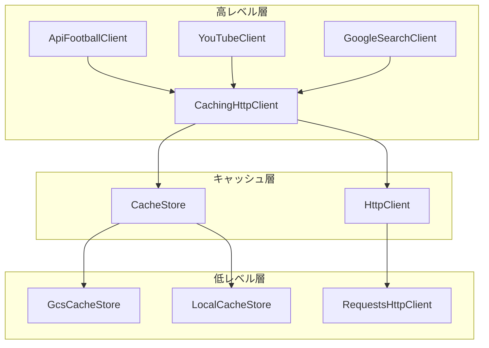
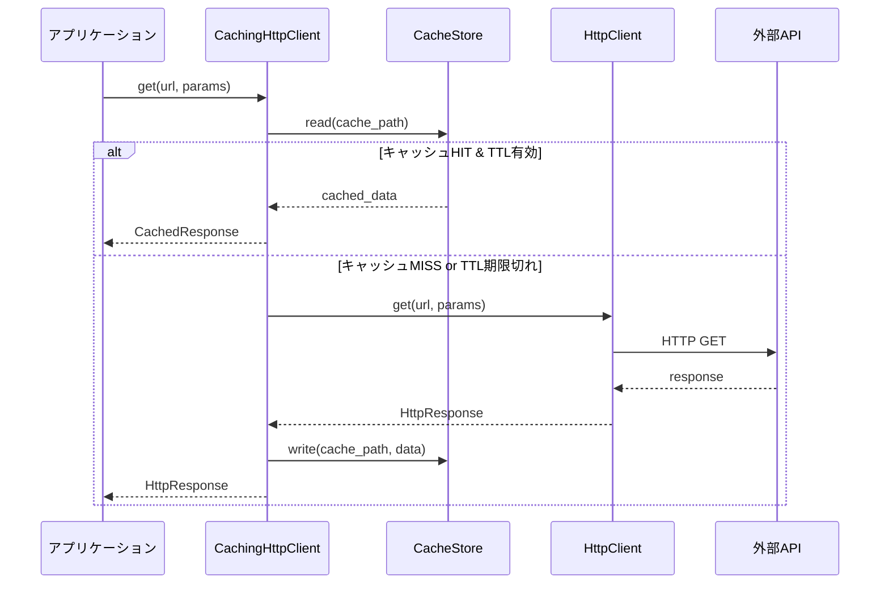

# キャッシュ設計書 (Cache Design Document)

## 1. 概要

外部APIへのリクエスト回数を削減し、クォータ消費を抑制するためのキャッシュ機構。
Google Cloud Storage (GCS) をプライマリバックエンドとして使用する。

### 1.1 目的

| 目的 | 説明 |
|------|------|
| **クォータ節約** | API-Football の日次上限 (100回/日) を効率的に活用 |
| **レスポンス高速化** | 2回目以降のリクエストはGCSから即座に取得 |
| **データ共有** | ローカル開発とGitHub Actionsで同一キャッシュを共有 |

### 1.2 対象API

| API | 実装クライアント | キャッシュ対応 |
|-----|-----------------|--------------|
| API-Football | `CachingHttpClient` | ✅ GCS対応 |
| YouTube Data API | `YouTubeClient` | ✅ GCS対応 |
| Google Custom Search | `GoogleSearchClient` | ✅ GCS対応 |

---

## 2. アーキテクチャ

### 2.1 レイヤー構成



### 2.2 責務分離

| コンポーネント | ファイル | 責務 |
|--------------|---------|------|
| **CacheStore** | `src/clients/cache_store.py` | ストレージバックエンド抽象化（GCS/Local） |
| **HttpClient** | `src/clients/http_client.py` | HTTP通信抽象化 |
| **CachingHttpClient** | `src/clients/caching_http_client.py` | キャッシュ付きHTTP実行、TTL判定 |
| **cache_config** | `settings/cache_config.py` | TTL設定、バックエンド設定 |

### 2.3 シーケンス図



---

## 3. 設定ファイル

### 3.1 環境変数

| 環境変数 | デフォルト | 説明 |
|----------|-----------|------|
| `GCS_CACHE_BUCKET` | `football-delay-watching-cache` | GCSバケット名 |
| `CACHE_BACKEND` | `gcs` | `local` or `gcs` |
| `USE_API_CACHE` | `True` | キャッシュ有効化フラグ |

### 3.2 TTL設定 (`settings/cache_config.py`)

```python
ENDPOINT_TTL_DAYS = {
    "players": None,      # 無期限（静的データ）
    "lineups": None,      # 無期限（試合後確定）
    "fixtures": 10,       # 10日間
    "headtohead": 10,     # 10日間
    "statistics": 10,     # 10日間
    "injuries": 0,        # キャッシュしない
    "squads": 7,          # 7日間
}
```

### 3.3 モード別キャッシュ動作

> [!IMPORTANT]
> 本番/Debug/Mockでキャッシュの動作が異なります。

| 環境変数 | 本番 (Actions) | Debug (ローカル) | Mock |
|----------|---------------|-----------------|------|
| `DEBUG_MODE` | `False` | `True` | `True` |
| `USE_MOCK_DATA` | `False` | `False` | `True` |
| `USE_API_CACHE` | `True` | `True` | `False` |
| `CACHE_BACKEND` | `gcs` | `gcs` | - |

---

## 4. 実装詳細

### 4.1 CacheStore (抽象基底クラス)

```python
class CacheStore(ABC):
    @abstractmethod
    def read(self, path: str) -> Optional[dict]: ...
    
    @abstractmethod
    def write(self, path: str, data: dict) -> None: ...
    
    @abstractmethod
    def exists(self, path: str) -> bool: ...
```

**実装クラス**:
- `LocalCacheStore` - ローカルファイルシステム
- `GcsCacheStore` - Google Cloud Storage

### 4.2 CachingHttpClient

```python
class CachingHttpClient:
    def __init__(
        self,
        store: CacheStore,
        http_client: HttpClient,
        ttl_config: Dict[str, Optional[int]] = None,
        use_cache: bool = True
    ): ...
    
    def get(
        self,
        url: str,
        headers: Dict[str, str] = None,
        params: Dict[str, Any] = None
    ) -> HttpResponse: ...
```

**処理フロー**:
1. URLとパラメータからキャッシュパスを生成
2. キャッシュが存在すればTTLをチェック
3. TTL有効なら `CachedResponse` を返却
4. TTL切れまたはキャッシュなしなら HTTP リクエスト実行
5. レスポンスをキャッシュに保存

### 4.3 ファクトリ関数

```python
# CacheStoreの生成
from src.clients.cache_store import create_cache_store
store = create_cache_store(backend="gcs")

# CachingHttpClientの生成
from src.clients.caching_http_client import create_caching_client
client = create_caching_client(backend="gcs", use_cache=True)
```

---

## 5. GCSバケット構造

```
gs://football-delay-watching-cache/
├── fixtures/
│   └── {league_id}_{date}_{home}_vs_{away}.json
├── lineups/
│   └── {fixture_id}_{home}_vs_{away}.json
├── players/
│   └── {team_name}/{player_id}.json
├── injuries/
│   └── {fixture_id}.json
├── statistics/
│   └── {team_name}_{season}_{league_id}.json
├── headtohead/
│   └── {team1}_vs_{team2}.json
└── youtube/
    └── {query_hash}.json
```

### 5.1 ファイル命名規則

| エンドポイント | パターン | 例 |
|--------------|---------|-----|
| `/fixtures` | `fixtures/{league_id}_{date}_{home}_vs_{away}.json` | `fixtures/39_2024-12-21_ManCity_vs_WestHam.json` |
| `/fixtures/lineups` | `lineups/{fixture_id}_{home}_vs_{away}.json` | `lineups/1234567_ManCity_vs_WestHam.json` |
| `/players` | `players/{team_name}/{player_id}.json` | `players/Manchester_City/123.json` |
| YouTube | `youtube/{query_hash}.json` | `youtube/abc123def456.json` |

---

## 6. TTL方針（キャッシュ有効期限）

| データ種別 | TTL | 理由 |
|-----------|-----|------|
| **選手データ** (`/players`) | 無期限 | 国籍、ポジション等は年単位で不変 |
| **スタメン** (`/lineups`) | 無期限 | 試合後は確定データ |
| **試合一覧** (`/fixtures`) | 10日間 | 開発中の連続実行に対応 |
| **過去対戦** (`/headtohead`) | 10日間 | 試合後に内容が変わる |
| **チーム統計** (`/statistics`) | 10日間 | リーグ進行で更新される |
| **負傷者** (`/injuries`) | 0 | 当日変動あり |
| **YouTube検索** | 7日間 | 新着動画の反映 |

---

## 7. キャッシュウォーミング

APIクォータに余裕がある平日に、上位チームの選手データを事前取得する機能。

| 設定項目 | 値 |
|---------|-----|
| 実装ファイル | `src/cache_warmer.py` |
| 対象チーム | EPL上位10チーム + CL上位13チーム |
| 実行条件 | 残クォータ > 30、09:00 JST前 |
| 制御 | `ExecutionPolicy` クラス |

---

## 8. 依存性注入 (DI)

テスト容易性のため、すべてのコンポーネントは依存性注入をサポート:

```python
# 本番用
store = GcsCacheStore(bucket_name="my-bucket")
http_client = RequestsHttpClient()
caching_client = CachingHttpClient(store, http_client)

# テスト用（モック注入）
mock_store = MockCacheStore()
mock_http = MockHttpClient()
caching_client = CachingHttpClient(mock_store, mock_http)
```

---

## 9. 確認コマンド

```bash
# GCSキャッシュ状況の確認
python healthcheck/check_gcs_cache.py

# API-Footballクォータ確認
python healthcheck/check_football_api.py
```

---

## 10. 関連ドキュメント

- [システム設計書](./system_overview.md) - 全体アーキテクチャ
- [API-Football エンドポイント詳細](./api_endpoints.md) - 各エンドポイントのパラメータ
