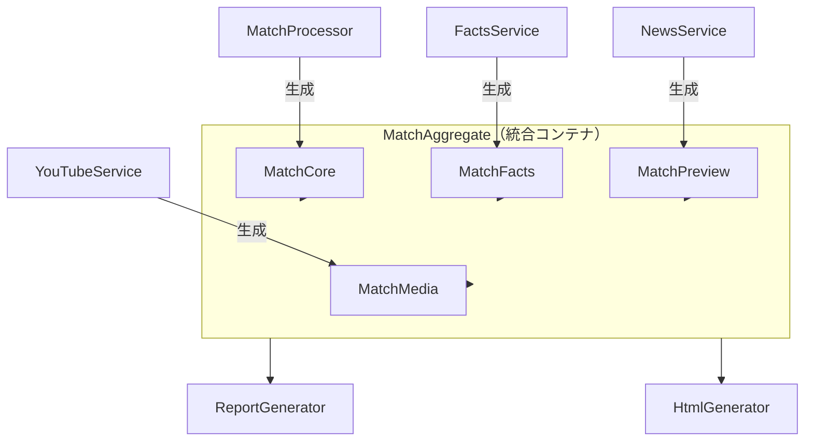

# ドメインモデル設計

本ドキュメントは `src/domain/models.py` のドメインモデル設計を記述する。

---

## モデル構成

### 責務分離モデル（Issue #100 で導入）



---

## クラス詳細

### MatchCore（試合基本情報）

| フィールド | 型 | 説明 |
|-----------|-----|------|
| `id` | `str` | 試合ID |
| `home_team` | `str` | ホームチーム名 |
| `away_team` | `str` | アウェイチーム名 |
| `competition` | `str` | 大会名 (EPL, CL等) |
| `kickoff_jst` | `str` | キックオフ時刻 (JST表示用) |
| `kickoff_local` | `str` | キックオフ時刻 (現地時間) |
| `kickoff_at_utc` | `datetime` | キックオフ時刻 (UTC計算用) |
| `rank` | `str` | 試合ランク (S, A, None) |
| `venue` | `str` | スタジアム名 |
| `referee` | `str` | 主審 |
| `home_logo` | `str` | ホームチームロゴURL |
| `away_logo` | `str` | アウェイチームロゴURL |

### MatchFacts（API取得データ）

| フィールド | 型 | 説明 |
|-----------|-----|------|
| `home_lineup` | `List[str]` | ホームスタメン |
| `away_lineup` | `List[str]` | アウェイスタメン |
| `home_bench` | `List[str]` | ホームベンチ |
| `away_bench` | `List[str]` | アウェイベンチ |
| `home_formation` | `str` | ホームフォーメーション |
| `away_formation` | `str` | アウェイフォーメーション |
| `player_nationalities` | `Dict[str, str]` | 選手国籍 |
| `player_numbers` | `Dict[str, int]` | 背番号 |
| `player_photos` | `Dict[str, str]` | 選手写真URL |
| `injuries_list` | `List[Dict]` | 負傷者リスト |
| `home_manager` | `str` | ホーム監督名 |
| `away_manager` | `str` | アウェイ監督名 |
| `h2h_summary` | `str` | 対戦成績 |

### MatchPreview（LLM生成データ）

| フィールド | 型 | 説明 |
|-----------|-----|------|
| `news_summary` | `str` | ニュース要約 (Gemini生成) |
| `tactical_preview` | `str` | 戦術プレビュー (Gemini生成) |
| `home_interview` | `str` | ホーム監督インタビュー要約 |
| `away_interview` | `str` | アウェイ監督インタビュー要約 |

### MatchMedia（メディアデータ）

| フィールド | 型 | 説明 |
|-----------|-----|------|
| `youtube_videos` | `Dict[str, List[Dict]]` | YouTube動画リスト |
| `formation_image_path` | `str` | フォーメーション画像パス |

### MatchAggregate（統合コンテナ）

| フィールド | 型 | 説明 |
|-----------|-----|------|
| `core` | `MatchCore` | 試合基本情報 |
| `facts` | `MatchFacts` | API取得データ |
| `preview` | `MatchPreview` | LLM生成データ |
| `media` | `MatchMedia` | メディアデータ |
| `error_status` | `str` | エラー状態 |

---

## 後方互換性

`MatchAggregate` は既存コードとの互換性のため、以下のようなプロパティアクセスをサポートします：

```python
# 従来のアクセス方法（後方互換）
match.home_team       # → match.core.home_team
match.home_lineup     # → match.facts.home_lineup
match.news_summary    # → match.preview.news_summary

# 推奨される明示的アクセス
match.core.home_team
match.facts.home_lineup
match.preview.news_summary
```

> [!NOTE]
> 後方互換プロパティは段階的移行のために用意されています。
> 新規コードでは明示的なアクセス（`match.core.*`, `match.facts.*` 等）を推奨します。

---

## MatchData（レガシー）

> [!WARNING]
> `MatchData` は後方互換性のため維持されていますが、将来削除予定です。
> 新規開発では `MatchAggregate` を使用してください。

---

## 関連Issue

- Issue #100: ドメインモデルリファクタリング
