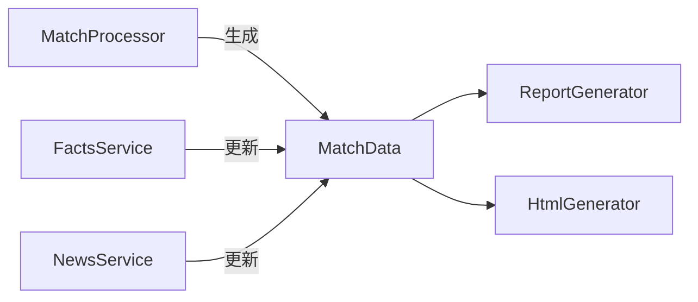

# ドメインモデル設計

本ドキュメントは `src/domain/models.py` のドメインモデル設計を記述する。

---

## MatchData

アプリケーション全体で使用される主要なドメインモデル。

---

## フィールド構成

| カテゴリ | フィールド | 設定元 |
|---------|-----------|--------|
| 試合基本情報 | `id`, `home_team`, `away_team`, `competition`, `kickoff_*`, `rank` | MatchProcessor |
| 選手・チーム情報 | `*_lineup`, `*_bench`, `*_formation`, `player_*` | FactsService |
| 追加取得情報 | `venue`, `referee`, `*_manager`, `h2h_summary` | FactsService |
| LLM生成コンテンツ | `news_summary`, `tactical_preview`, `*_interview` | NewsService |
| エラー状態 | `error_status` | 各サービス |

---

## データフロー

1. **MatchProcessor**: API-Football から試合一覧を取得し、`MatchData` を生成
2. **FactsService**: 各試合のスタメン・フォーメーション・選手情報を追加
3. **NewsService**: ニュース検索 + Gemini 要約でプレビュー情報を追加
4. **YouTubeService**: 動画情報を取得（別途 `Dict[str, List[Dict]]` で管理）
5. **ReportGenerator**: Markdown レポートを生成
6. **HtmlGenerator**: HTML に変換
