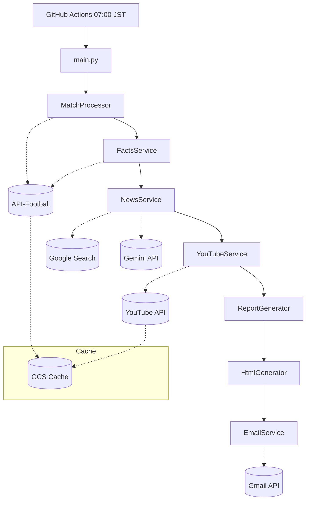

# 設計書

本ドキュメントは、機能要件 ([01_requirements/index.md](../01_requirements/index.md)) を実現するための設計を記述する。

---

## 設計ドキュメント一覧

| ドキュメント | 概要 | 対応機能 |
|-------------|------|----------|
| [system_overview.md](./system_overview.md) | システム全体設計・アーキテクチャ構成図 | 全体 |
| [external_apis.md](./external_apis.md) | 外部API連携設計（API-Football, Google Search, Gemini） | Match, Facts, News |
| [infrastructure.md](./infrastructure.md) | 実行基盤設計（GitHub Actions, 時刻処理） | 全体 |
| [cache_design.md](./cache_design.md) | キャッシュ設計（GCS, TTL） | Match, Facts, YouTube |
| [login_design.md](./login_design.md) | ログイン・認証設計（Firebase Auth） | Delivery |
| [api_endpoints.md](./api_endpoints.md) | API-Football エンドポイント詳細 | Match, Facts |

---

## アーキテクチャ概要

---

## 技術スタック

| カテゴリ | 技術 | 用途 |
|---------|------|------|
| 言語 | Python 3.11 | アプリケーション |
| 実行基盤 | GitHub Actions | スケジュール実行 |
| キャッシュ | Google Cloud Storage | APIレスポンスキャッシュ |
| ホスティング | Firebase Hosting | レポート配信 |
| 認証 | Firebase Auth | ログイン機能 |

---

## 環境変数

詳細はローカル開発環境の `.env` および GitHub Secrets に設定する。

| サービス | 環境変数名 | 用途 |
|----------|-----------|------|
| API-Football | `RAPIDAPI_KEY` | 試合データ取得 |
| Gemini API | `GOOGLE_API_KEY` | AI要約・検閲 |
| Google Search | `GOOGLE_SEARCH_API_KEY`, `GOOGLE_SEARCH_ENGINE_ID` | 記事検索 |
| Gmail API | `GMAIL_TOKEN`, `GMAIL_CREDENTIALS` | メール送信認証 |
| メール設定 | `NOTIFY_EMAIL`, `GMAIL_ENABLED` | 送信先・有効化 |
