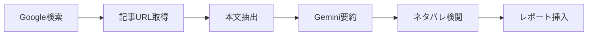

# ニュース検索設計

Google Custom Search APIを使用したニュース記事収集の設計。

---

## 1. Google Custom Search設計

### 1.1 概要

| 項目 | 値 |
|------|-----|
| サービス | Google Custom Search API |
| 実装クラス | `GoogleSearchClient` |
| 認証 | API Key + Search Engine ID |

### 1.2 検索スペック

| 種別 | クエリテンプレート | 期間制限 | 地域 |
|------|-------------------|---------|------|
| ニュース | `"{home}" "{away}" match preview` | 2日 | US/JP |
| 監督インタビュー | `"{team}" manager "said" press conference` | 7日 | UK |
| 選手インタビュー | `"{team}" player interview "said"` | 7日 | UK |

> 実装: [settings/search_specs.py](../../settings/search_specs.py) の `GOOGLE_SEARCH_SPECS`

### 1.3 ネタバレ防止の除外キーワード

すべてのクエリに以下の除外キーワードを付与:

```
-women -WFC -WSL -女子
```

| 除外対象 | 理由 |
|---------|------|
| `-women`, `-WFC`, `-WSL` | 女子サッカーの結果混入防止 |
| `-女子` | 日本語検索時の混入防止 |
| `-result`, `-score` | スコア結果の混入防止 |
| `-twitter.com`, `-x.com` | SNS投稿の除外（更新性が低い） |

### 1.4 検索制限

| 項目 | 値 |
|------|-----|
| 日次クォータ | 100リクエスト/日 |
| 1検索あたり結果数 | 5-10件 |
| キャッシュTTL | 2時間 |

---

## 2. ニュース処理フロー



---

## 3. 関連ドキュメント

- [外部API連携設計](./external_apis.md) - Google Search / Gemini API概要
- [LLM制約仕様](./llm_constraints.md) - 要約・検閲の制約
- [キャッシュ設計](./cache_design.md) - GCSキャッシュ
