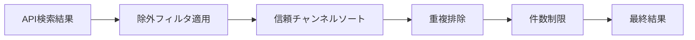

# 検索設計

YouTube検索とGoogle Custom Searchの設計詳細を定義する。

---

## 1. YouTube検索カテゴリ別仕様

YouTube Data API v3を使用した動画検索の設計。キックオフ前の関連動画を取得し、ネタバレを防止する。

### 1.1 検索カテゴリ一覧

| カテゴリ | クエリテンプレート | 検索期間 | 言語 | 最大件数 |
|---------|-------------------|---------|------|---------|
| 記者会見 | `{team} {manager} press conference` | 48時間前〜キックオフ | 英語 | 2/チーム |
| 過去対戦 | `{home} vs {away} highlights` | 730日前〜24時間前 | - | 1 |
| 戦術分析 | `{team} 戦術 分析` | 180日前〜キックオフ | 日本語 | 2/チーム |
| 選手紹介 | `{player} {team} プレー` | 180日前〜キックオフ | 日本語 | 6 |
| 練習風景 | `{team} training` | 168時間前〜キックオフ | 英語 | 2/チーム |

> 実装: [settings/search_specs.py](../../settings/search_specs.py) の `YOUTUBE_SEARCH_SPECS`

### 1.2 検索期間の設計意図

| カテゴリ | 期間 | 設計理由 |
|---------|------|---------|
| 記者会見 | 48時間前 | 試合前会見は通常1-2日前に実施 |
| 過去対戦 | 730日〜24時間前 | 過去2年の対戦を対象、直近24時間は除外（ネタバレ防止） |
| 戦術分析 | 180日前 | シーズン内の戦術解説を網羅 |
| 選手紹介 | 180日前 | 選手のプレー集は長期間有効 |
| 練習風景 | 168時間前 | 1週間以内の直近練習動画 |

### 1.3 言語設定

| 言語 | 対象カテゴリ | API パラメータ |
|------|------------|---------------|
| 英語 | 記者会見, 練習風景 | `relevanceLanguage=en` |
| 日本語 | 戦術分析, 選手紹介 | `relevanceLanguage=ja` |
| 未指定 | 過去対戦 | デフォルト（地域依存） |

---

## 2. 信頼チャンネル設計

YouTube動画の信頼性を判定し、優先表示するための設計。

### 2.1 チャンネルカテゴリ

| カテゴリ | 説明 | 例 |
|---------|------|-----|
| `team` | クラブ公式 | Man City, Liverpool, Arsenal |
| `league` | リーグ公式 | Premier League, UEFA Champions League |
| `broadcaster` | 放送局 | Sky Sports, TNT Sports, BBC |
| `tactics` | 戦術解説 | The Athletic FC, レオザフットボール |

> 実装: [settings/channels.py](../../settings/channels.py) の `TRUSTED_CHANNELS`

### 2.2 優先度ルール

信頼チャンネルフィルターは **post-fetch方式** で動作する:

1. チャンネル指定なしで検索を実行（API効率化）
2. 結果を信頼チャンネル優先でソート
3. バッジを付与して表示

```
ソート順: 信頼チャンネル (is_trusted=True) → 非信頼チャンネル (is_trusted=False)
```

### 2.3 バッジ表示

| 状態 | バッジ | 表示例 |
|------|--------|--------|
| 信頼チャンネル | ✅ | ✅ Liverpool FC |
| 非信頼チャンネル | ⚠️ | ⚠️ FootballHighlightsHD |

> 実装: [src/youtube_filter.py](../../src/youtube_filter.py) の `YouTubePostFilter.sort_trusted()`

---

## 3. Google Custom Search設計

ニュース記事の収集に使用するGoogle Custom Search APIの設計。

### 3.1 検索スペック

| 種別 | クエリテンプレート | 期間制限 | 地域 |
|------|-------------------|---------|------|
| ニュース | `"{home}" "{away}" match preview` | 2日 | US/JP |
| 監督インタビュー | `"{team}" manager "said" press conference` | 7日 | UK |
| 選手インタビュー | `"{team}" player interview "said"` | 7日 | UK |

> 実装: [settings/search_specs.py](../../settings/search_specs.py) の `GOOGLE_SEARCH_SPECS`

### 3.2 ネタバレ防止の除外キーワード

すべてのクエリに以下の除外キーワードを付与:

```
-women -WFC -WSL -女子
```

| 除外対象 | 理由 |
|---------|------|
| `-women`, `-WFC`, `-WSL` | 女子サッカーの結果混入防止 |
| `-女子` | 日本語検索時の混入防止 |
| `-result`, `-score` | スコア結果の混入防止 |
| `-twitter.com`, `-x.com` | SNS投稿の除外（更新性が低い） |

### 3.3 検索制限

| 項目 | 値 |
|------|-----|
| 日次クォータ | 100リクエスト/日 |
| 1検索あたり結果数 | 5-10件 |
| キャッシュTTL | 2時間 |

---

## 4. YouTubePostFilter設計

YouTube検索結果のフィルタリングを担当するクラスの設計。

### 4.1 除外ルール一覧

| フィルタ名 | 除外対象キーワード | 適用カテゴリ |
|-----------|------------------|-------------|
| `match_highlights` | `highlights` + `vs`/`v` | 記者会見, 戦術分析, 選手紹介, 練習風景 |
| `highlights` | `highlights`, `match highlights`, `extended highlights` | 同上 |
| `full_match` | `full match`, `full game`, `full replay` | 同上 |
| `live_stream` | `live`, `livestream`, `watch live`, `streaming` | 全カテゴリ |
| `press_conference` | `press conference` | 過去対戦, 戦術分析, 選手紹介 |
| `reaction` | `reaction` | 全カテゴリ |

> 実装: [src/youtube_filter.py](../../src/youtube_filter.py) の `YouTubePostFilter`

### 4.2 フィルタ適用フロー



### 4.3 カテゴリ別適用フィルタ

| カテゴリ | 適用フィルタ |
|---------|-------------|
| 記者会見 | `match_highlights`, `highlights`, `full_match`, `live_stream`, `reaction` |
| 過去対戦 | `live_stream`, `press_conference`, `reaction` |
| 戦術分析 | `match_highlights`, `highlights`, `full_match`, `live_stream`, `press_conference`, `reaction` |
| 選手紹介 | `match_highlights`, `highlights`, `full_match`, `live_stream`, `press_conference`, `reaction` |
| 練習風景 | `match_highlights`, `highlights`, `full_match`, `live_stream`, `press_conference`, `reaction` |

### 4.4 フィルタ結果の返却形式

```python
{
    "kept": [...],      # フィルタを通過した動画
    "removed": [...],   # 除外された動画（reason付き）
    "overflow": [...]   # 件数超過で切り捨てた動画
}
```

---

## 5. 関連ドキュメント

- [YouTube動画取得要件](../01_requirements/youtube_integration.md) - 機能要件定義
- [外部API連携設計](./external_apis.md) - API概要
- [キャッシュ設計](./cache_design.md) - GCSキャッシュ
