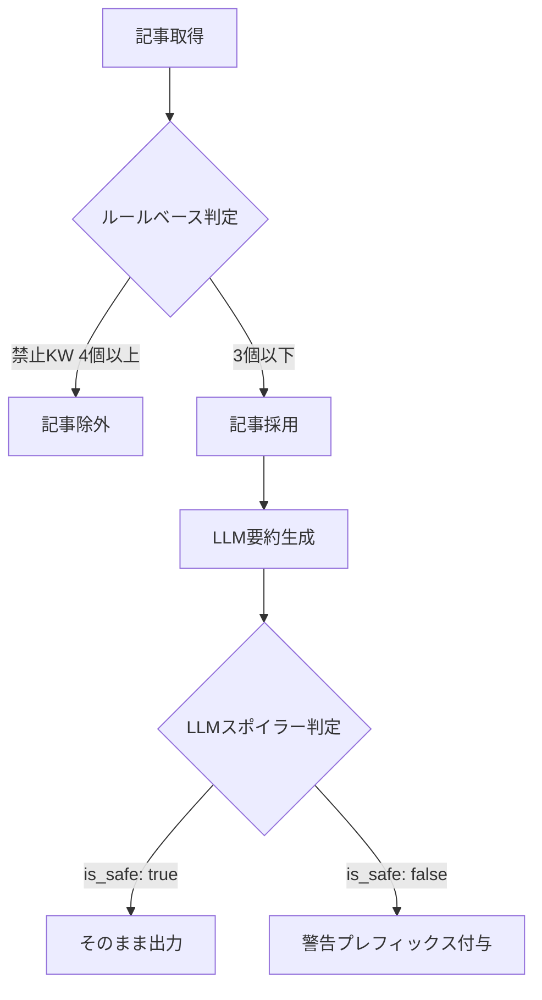

# LLM制約仕様

本ドキュメントは、Gemini APIを使用したLLM機能の入出力制約を設計として明文化する。
プロンプトのチューニング時には本仕様を参照し、制約を維持すること。

> **関連**: 機能要件は [01_requirements/index.md](../01_requirements/index.md) を参照。

---

## 1. 概要

### 1.1 目的

- ネタバレ（試合結果）を含まない試合前情報をユーザーに提供する
- LLM出力の品質と安全性を一定水準に保つ
- プロンプト改修時に「何を守るべきか」を明確にする

### 1.2 スコープ

| 対象 | 説明 |
|------|------|
| ニュース要約 | `generate_news_summary` |
| 戦術プレビュー | `generate_tactical_preview` |
| スポイラー判定 | `check_spoiler` |
| インタビュー要約 | `summarize_interview` |

### 1.3 実装箇所

- **LLMクライアント**: `src/clients/llm_client.py`
- **スポイラーフィルター**: `src/utils/spoiler_filter.py`
- **ニュースサービス**: `src/news_service.py`

---

## 2. 入力条件

### 2.1 対象言語

| 項目 | 値 |
|------|-----|
| 入力言語 | 英語（ニュース記事）、日本語（一部） |
| 出力言語 | 日本語 |

### 2.2 入力ソース

| ソース | 取得方法 | 用途 |
|--------|----------|------|
| ニュース記事 | Google Custom Search API | 要約・戦術プレビュー |
| インタビュー記事 | Google Custom Search API | インタビュー要約 |

### 2.3 入力制限

| 制約 | 値 | 理由 |
|------|-----|------|
| スポイラー判定入力上限 | 1,500文字 | トークン節約・コスト削減 |

---

## 3. 禁止事項（Constraints）

### 3.1 結果言及禁止

以下の情報をLLM出力に含めてはならない：

| カテゴリ | 例 |
|----------|-----|
| スコア | `2-1`, `3-0`, `1-1` |
| 勝敗 | `〇〇が勝利`, `敗北`, `won`, `lost`, `beat` |
| 得点者 | `〇〇がゴール`, `scored`, `netted` |
| 勝ち点 | `勝ち点3獲得`, `points` |

### 3.2 前置き文禁止

LLM応答の冒頭に以下のようなAI応答文を含めてはならない：

- `はい、承知いたしました`
- `以下に〜を記載します`
- `Here is the summary:`

**理由**: レポートに直接埋め込むため、本文のみが必要。

### 3.3 補完・推測禁止

- 入力記事に含まれない情報を補完してはならない
- LLMの事前知識による追記は禁止

---

## 4. 判定基準（Spoiler Detection）

### 4.1 二段階判定フロー



### 4.2 ルールベース判定（SpoilerFilter）

**実装**: `src/utils/spoiler_filter.py`

記事内の禁止キーワード出現数をカウントし、閾値超過で除外。

| 閾値 | 判定 |
|------|------|
| ≤ 3個 | 採用 |
| > 3個 | 除外（マッチレポートと推定） |

### 4.3 LLMスポイラー判定（check_spoiler）

**実装**: `src/clients/llm_client.py` L135-178

ルールベースを通過した要約に対し、LLMで最終判定を行う。

**判定基準**（プロンプトで指示）:

1. スコア（例: 2-1, 3-0）の記載
2. 勝敗の記載（例: 〇〇が勝利、敗北、won, lost）
3. ゴールを決めた選手名（得点者）

---

## 5. 失敗時挙動（Fallback）

### 5.1 APIエラー時

| 機能 | 挙動 | 実装箇所 |
|------|------|----------|
| generate_news_summary | `"Error generating summary"` を返却 | L96-98 |
| generate_tactical_preview | `"Error generating preview"` を返却 | L131-133 |
| summarize_interview | `"【{team}】要約エラー（{error_type}）"` を返却 | L208-210 |
| check_spoiler | `(True, "判定スキップ（APIエラー）")` を返却 | L177-178 |

### 5.2 JSON解析エラー時（check_spoiler）

| 条件 | 挙動 |
|------|------|
| JSONパースに失敗 | `(True, "判定スキップ（JSON解析エラー）")` を返却 |

**設計意図**: 判定不能時は「安全」とみなしてスキップ（false negativeを許容）

### 5.3 記事未取得時

| 機能 | 挙動 |
|------|------|
| generate_news_summary | `"No articles found to generate content."` |
| generate_tactical_preview | `"No articles found to generate content."` |
| summarize_interview | `"【{team}】関連記事が見つかりませんでした"` |

### 5.4 スポイラー検出時

| 条件 | 挙動 | 実装箇所 |
|------|------|----------|
| `is_safe: false` | 警告プレフィックスを付与して出力 | `news_service.py` L57-59 |

出力例:
```
⚠️ 結果言及の可能性あり: スコアの記載あり

[元の要約テキスト]
```

---

## 6. 機能別プロンプト仕様

### 6.1 generate_news_summary

**目的**: ニュース記事から試合前サマリーを生成

**現行プロンプト**:
```
Task: Summarize the following news snippets for '{home_team} vs {away_team}' into a Japanese pre-match summary (600-1000 chars).

Constraints:
- Do NOT reveal results. Check sources provided in context if needed.
- 前置き文（「はい、承知いたしました」「以下に」等のAI応答文）は絶対に含めず、本文のみを出力してください。

Context:
{context}
```

**制約ポイント**:
| 制約 | 指示内容 |
|------|----------|
| 結果言及禁止 | `Do NOT reveal results` |
| 前置き文禁止 | 日本語で明示的に禁止 |
| 出力文字数 | 600-1000文字 |
| 出力言語 | Japanese |

---

### 6.2 generate_tactical_preview

**目的**: 戦術分析を抽出・生成

**現行プロンプト**:
```
Task: Extract tactical analysis for '{home_team} vs {away_team}' (Japanese).

Constraints:
- Focus on likely formations and matchups. Do NOT reveal results.
- 前置き文（「はい、承知いたしました」「以下に」等のAI応答文）は絶対に含めず、本文のみを出力してください。
- 最初の一文から戦術分析の内容を開始してください。

Context:
{context}
```

**制約ポイント**:
| 制約 | 指示内容 |
|------|----------|
| 結果言及禁止 | `Do NOT reveal results` |
| 前置き文禁止 | 日本語で明示的に禁止 |
| 冒頭指示 | 最初の一文から本文開始 |
| フォーカス | フォーメーション・マッチアップ |

---

### 6.3 check_spoiler

**目的**: 生成されたテキストがネタバレを含むか判定

**現行プロンプト**:
```
以下のテキストが「{home_team} vs {away_team}」の試合結果を言及しているかを判定してください。

テキスト:
{text[:1500]}

判定基準:
- スコア（例: 2-1, 3-0）の記載
- 勝敗の記載（例: 〇〇が勝利、敗北、won, lost）
- ゴールを決めた選手名（得点者）

回答は以下のJSON形式のみで（説明不要）:
{"is_safe": true, "reason": "なし"} または {"is_safe": false, "reason": "理由"}
```

**制約ポイント**:
| 制約 | 指示内容 |
|------|----------|
| 入力上限 | 1,500文字（トークン節約） |
| 出力形式 | JSON固定 |
| 説明禁止 | JSONのみ出力 |
| 判定基準 | スコア、勝敗、得点者の3項目 |

---

### 6.4 summarize_interview

**目的**: インタビュー記事を要約

**現行プロンプト**:
```
Task: 以下のニュース記事から、{team_name}の監督や選手の試合前コメントを日本語で要約してください（200-300字）。
Format: 【{team_name}】で始めて、監督や選手の発言を引用形式で含めてください。
Constraint: 試合結果に関する情報は絶対に含めないでください。

Context:
{context}
```

**制約ポイント**:
| 制約 | 指示内容 |
|------|----------|
| 結果言及禁止 | `試合結果に関する情報は絶対に含めない` |
| 出力文字数 | 200-300字 |
| 出力形式 | `【チーム名】`で開始、引用形式 |

---

## 7. 禁止キーワードリスト

**実装**: `src/utils/spoiler_filter.py` L18-23

### 7.1 英語キーワード

```python
[
    "won", "lost", "victory", "defeat", "beat", "winner", "loser",
    "goal", "scored", "scoresheet", "netted"
]
```

### 7.2 日本語キーワード

```python
[
    "勝った", "負けた", "勝利", "敗北", "勝ち点3", "points",
    "得点", "ゴール", "先制", "決勝点"
]
```

### 7.3 スコアパターン（正規表現）

```python
# フォーメーション（3-4-3等）を除外し、スコア（2-1等）のみ検出
r'(?<!\d-)(\b\d{1,2}-\d{1,2}\b)(?!-\d)'
```

**除外パターン**（誤検出防止）:
- `3-4-3`, `4-3-3`, `3-4-2-1` 等のフォーメーション表記

---

## 8. チューニングガイドライン

### 8.1 プロンプト変更時の注意

1. **制約の維持**: セクション3の禁止事項を必ず含める
2. **形式の維持**: check_spoilerのJSON出力形式は変更不可
3. **本ドキュメントの更新**: プロンプト変更時は本仕様も同期更新する

### 8.2 禁止キーワード追加時

1. `spoiler_filter.py` の `banned_keywords` リストに追加
2. 本ドキュメントのセクション7を更新
3. 誤検出（false positive）が増えないか検証

### 8.3 判定精度の評価

| 指標 | 説明 | 許容方針 |
|------|------|----------|
| False Positive | 安全なテキストを危険と判定 | 警告表示で対応（許容） |
| False Negative | 危険なテキストを見逃し | 最小化を目指す |

**設計思想**: ユーザー体験を損なわないため、判定スキップ時は「安全」とみなす（False Negativeを許容）。

---

## 関連ドキュメント

- [external_apis.md](./external_apis.md) - Gemini API連携設計
- [../01_requirements/index.md](../01_requirements/index.md) - 機能要件
