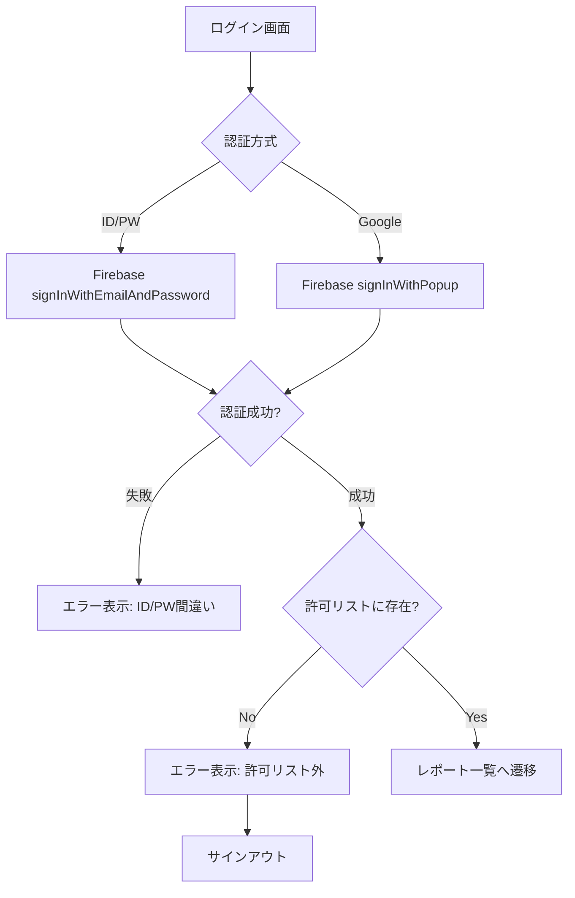

# ログイン機能 要件・設計書

## 1. 要件

### 1.1 認証方式

| 方式 | 説明 | 用途 |
|------|------|------|
| ID/PW認証 | メールアドレス+パスワードでログイン | テスト・開発用（管理者のみ発行可能） |
| Google OAuth | Googleアカウントでログイン | 本運用向け（許可リスト制御） |

### 1.2 認可ルール

- **許可リスト制御**: `allowed_emails.json` に登録されたメールアドレスのみアクセス可能
- 管理者が許可リストを編集 → デプロイで反映

### 1.3 エラーメッセージ

| ケース | メッセージ |
|--------|-----------|
| ID/PW間違い | 「メールアドレスまたはパスワードが間違っています」 |
| OAuth許可リスト外 | 「このアカウントは許可リストに登録されていません」 |

### 1.4 ログイン後の遷移

- ログイン成功 → 「ログイン成功！」表示 → レポート一覧画面へ遷移

---

## 2. 技術設計

### 2.1 使用技術

- **Firebase Authentication**
  - Firebase JS SDK v10.7.1 (modular版, ES Modules)
  - Email/Password Provider
  - Google Provider (Popup mode only)
  - **Persistence**: 明示的に `LOCAL` を設定（ブラウザを閉じても維持）
- **認可チェック**: クライアント側で `allowed_emails.json` と照合
- **Mobile Support**: Limited (Popup may be blocked or fail on some mobile browsers)

### 2.2 ファイル構成

```
public/
├── index.html           # ログイン画面 + レポート一覧
├── allowed_emails.json  # 許可メールアドレスリスト
└── firebase_config.json # Firebase設定
```

### 2.3 認証フロー



### 2.4 allowed_emails.json 形式

```json
{
    "emails": [
        "nakame.kate@gmail.com",
        "sampleexample@gmail.com"
    ]
}
```

---

## 3. UI設計

### 3.1 ログイン画面

```
┌─────────────────────────────────┐
│      ⚽ サッカー観戦ガイド        │
│                                 │
│  ┌───────────────────────────┐  │
│  │  メールアドレス            │  │
│  │  [                    ]   │  │
│  │  パスワード               │  │
│  │  [                    ]   │  │
│  │  [🔐 ログイン]            │  │
│  │                           │  │
│  │  ─────── または ───────   │  │
│  │                           │  │
│  │  [G Googleでログイン]     │  │
│  │                           │  │
│  │  エラーメッセージ表示欄    │  │
│  └───────────────────────────┘  │
└─────────────────────────────────┘
```

### 3.2 エラー表示

- **赤色テキスト**で表示
- ログインボタンの下に配置

---

## 4. 詳細仕様

### 4.1 セッション保持 (Persistence)
- **Web (ブラウザ)**:
  - **設定**: `LOCAL` (ブラウザを閉じても維持される)
  - **実装**: 常に明示的に `setPersistence(auth, browserLocalPersistence)` を呼び出し、永続化を保証する。
  - **WebView (Instagram/LINE等)**: ブラウザ仕様に依存するが、基本的にはCookie/LocalStorageがクリアされない限り維持される。ただし、アプリ内ブラウザの仕様でセッションが切れる場合がある。

### 4.2 マルチデバイス・同時ログイン
- **仕様**: 1つのユーザーアカウントで**複数端末からの同時ログインが可能**。
- **排他制御**: なし（PCでログインしてもスマホ側はログアウトされない）。各端末のセッションは独立して管理される。
- **ログアウト**: クライアント側での `signOut()` は、**操作した端末のみ**ログアウトされる。全端末一斉ログアウト機能は実装しない。

---

## 5. Firebase Console 設定

管理画面: https://console.firebase.google.com/u/0/project/football-delay-watching-a8830/authentication/providers

### 5.1 必須設定 (Authentication)

1.  **Sign-in method (プロバイダ設定)**
    -   **Email/Password**: `Enabled` (有効)
        -   Email link (passwordless sign-in): `Disabled`
    -   **Google**: `Enabled` (有効)
        -   Web SDK configuration: Client ID / Secret が正しく設定されていること（GCP連携時に自動設定されるが要確認）

2.  **Settings (全般設定)**
    -   **Authorized domains (承認済みドメイン)**
        -   `football-delay-watching-a8830.web.app` (本番)
        -   `football-delay-watching-a8830.firebaseapp.com` (本番エイリアス)
        -   `localhost` (ローカル開発用)
        -   *(Option)* カスタムドメインを使用する場合はここに追加必須

3.  **Advanced (高度な設定)**
    -   **Account Linking (アカウントリンク)**
        -   通常は「同じメールアドレスのアカウントをリンクする」がデフォルトで有効。
        -   GoogleアカウントとEmail/PWアカウントで同じメアドが使われた場合、1つのUIDに統合される設定が望ましい。

### 5.2 ユーザー追加手順

1.  `public/allowed_emails.json` に許可するメールアドレスを追加
2.  `firebase deploy --only hosting` でデプロイ
3.  Email/Password認証を使う場合は、Firebase Console > Authentication > Users で事前にユーザーを作成する必要がある

### 5.3 Hosting 設定
- **Hosting URL**: `https://football-delay-watching-a8830.web.app`
- **デプロイ**: CLI (`firebase deploy`) 経由で静的ファイル（`public/`）をアップロード。

---

## 6. 既知の課題

| 課題 | 対応状況 | Issue |
|------|----------|-------|
| Email/Password認証が機能しない | 未対応 | [#183](https://github.com/igrekplus/football-delay-watching/issues/183) |
| Firebase SDK v8 → v9 移行 | 対応済み | [#184](https://github.com/igrekplus/football-delay-watching/issues/184) |
| `allowed_emails.json` の公開露出 | 許容（ドキュメント化済み） | - |

