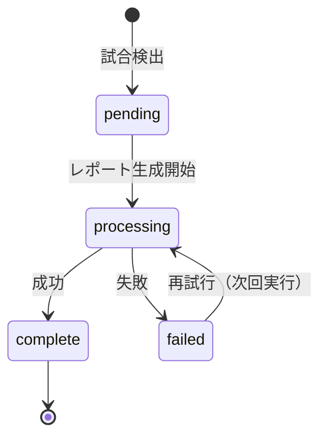
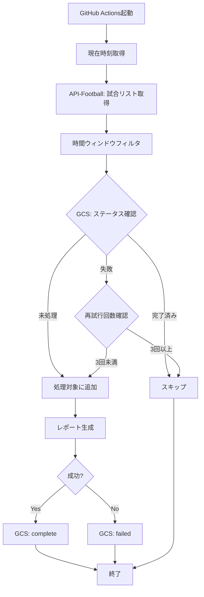

# 試合スケジュール管理 (Match Scheduler)

## 概要

3時間ごとに実行される GitHub Actions において、どの試合をレポート生成対象とするかを管

理するコンポーネント。

**Issue #101 (Dynamic Execution Schedule)** の要件に基づき、以下を実現する：
1. 時間ウィンドウによる試合フィルタリング
2. Fixture単位の処理ステータス管理（GCS）
3. 失敗時の自動再試行

---

## 要件仕様

### 1. 時間ウィンドウ

**Actionsは3時間に1回実行される（0時、3時、6時、9時、12時、15時、18時、21時 JST）**

各実行時のタイミングで、以下の時間窓内の試合を取得対象とする：

```
キックオフ1時間前 ≦ 現在時刻 ≦ キックオフ + α分
```

**例：21時に実行する場合**
- 20時キックオフ：キックオフ済み（1時間前から対象）
- 21時キックオフ：キックオフ済み（現在時刻）
- 22時キックオフ：キックオフ前1時間（対象）

### 2. ステータス管理

**問題：**
毎回「キックオフ済みの全ての試合」を取得してしまうと、同じ試合を何度も処理してしまう。

**解決策：**
fixturesに対する試合の**取得済み/未済を GCS上のテーブルで管理**する。

#### 2.1 GCSテーブル構造

**ファイルパス:** `gs://{bucket}/schedule/fixture_status.csv`

| カラム | 型 | 説明 |
|--------|-----|------|
| `fixture_id` | string | API-FootballのfixtuId |
| `date` | string | 試合日（YYYY-MM-DD） |
| `kickoff_jst` | string | キックオフ時刻（JST, ISO8601） |
| `status` | string | `pending`, `processing`, `complete`, `failed` |
| `first_attempt_at` | string | 初回処理試行時刻（ISO8601） |
| `last_attempt_at` | string | 最終処理試行時刻（ISO8601） |
| `attempts` | int | 試行回数 |
| `error_message` | string | エラーメッセージ（失敗時のみ） |

#### 2.2 ステータス遷移



### 3. 処理フロー



---

## 実装設計

### コンポーネント構成

```
src/
├── utils/
│   ├── match_scheduler.py       # 時間ウィンドウ判定
│   └── fixture_status_manager.py # 新規: GCSステータス管理
├── clients/
│   └── schedule_status_client.py # 既存: 日付単位ステータス（参考）
└── workflows/
    └── generate_guide_workflow.py # ワークフロー統合
```

### 新規クラス: `FixtureStatusManager`

```python
class FixtureStatusManager:
    """Fixture単位の処理ステータス管理（GCS）"""
    
    CSV_PATH = "schedule/fixture_status.csv"
    MAX_RETRY_ATTEMPTS = 3
    
    def get_status(self, fixture_id: str) -> Optional[str]:
        """fixtureIdのステータスを取得"""
        pass
    
    def is_processable(self, fixture_id: str) -> bool:
        """処理対象かどうか判定（未処理 or 失敗で再試行可能）"""
        pass
    
    def mark_processing(self, fixture_id: str, kickoff_jst: datetime) -> bool:
        """処理開始をマーク"""
        pass
    
    def mark_complete(self, fixture_id: str) -> bool:
        """処理完了をマーク"""
        pass
    
    def mark_failed(self, fixture_id: str, error: str) -> bool:
        """処理失敗をマーク（再試行カウント増加）"""
        pass
```

### 既存クラス修正: `MatchScheduler`

**現在の問題：**
- `_is_in_target_window()` が「キックオフ30分後まで」で固定
- これでは21時キックオフの試合が0時実行で除外される

**修正案：**

```python
class MatchScheduler:
    # 時間窓の拡張
    BEFORE_KICKOFF_MINUTES = 60
    AFTER_KICKOFF_MINUTES = 60  # 30分→60分に拡張
    
    def filter_processable_matches(self, matches: List, status_manager: FixtureStatusManager) -> List:
        """時間窓 + ステータス管理による二段階フィルタ"""
        # 1. 時間ウィンドウでフィルタ
        time_filtered = [m for m in matches if self._is_in_target_window(m)]
        
        # 2. GCSステータスでフィルタ
        processable = [m for m in time_filtered if status_manager.is_processable(m.id)]
        
        return processable
```

### ワークフロー統合

**`generate_guide_workflow.py` の修正箇所：**

```python
def run(self, dry_run: bool = False):
    # 1. Match Extraction
    processor = MatchProcessor()
    all_matches = processor.run()
    
    if not config.USE_MOCK_DATA and not config.DEBUG_MODE:
        # 2. ステータス管理初期化
        status_manager = FixtureStatusManager()
        scheduler = MatchScheduler()
        
        # 3. 時間 + ステータスフィルタ
        matches = scheduler.filter_processable_matches(all_matches, status_manager)
        
        if not matches:
            logger.info("現在処理対象の試合なし")
            return
        
        # 4. 処理開始マーク
        for match in matches:
            status_manager.mark_processing(match.id, match.kickoff_at_utc)
    else:
        matches = all_matches
    
    # 5. レポート生成
    try:
        # ... 既存の処理 ...
        
        # 6. 成功時: update status (is_target=Trueのみ)
        if status_manager:
            for match in matches:
                if match.is_target:
                    status_manager.mark_complete(match.id)
                else:
                    # is_target=Falseはスキップ (再試行対象に残す)
                    pass

    except Exception as e:
        # 7. 失敗時: failed マーク
        if status_manager:
            for match in matches:
                status_manager.mark_failed(match.id, str(e))
        raise
```

---

## 参考実装

- `src/workflows/generate_guide_workflow.py` - ワークフロー本体

## 試合選択ロジック (Match Selection Logic)

`MatchSelector` は、以下のロジックに従ってレポート生成対象とする試合を選定する（最大数: `config.MATCH_LIMIT`）。

### 1. ランク判定順序
試合には優先度ランク(S, A, None)が付与され、以下の順序で選定される：

1. **Rank S**: 最優先（例: Manchester City）
2. **Rank A**: 高優先
    - `config.A_RANK_TEAMS` に含まれるチーム
    - **定義**: Arsenal, Chelsea, Brighton, Manchester United, Liverpool, Tottenham, Leeds United, Barcelona, Real Madrid, Atletico Madrid, Real Sociedad
    - 日本人選手所属チーム（出場予定の選手情報が取得できた場合）
3. **Rank None**: その他

### 2. 同ランク時のタイブレーク
ランクが同じ場合（特に Rank None 同士）、コンペティションの優先度で順位が決まる：

1. `CL` (Champions League)
2. `LALIGA` (La Liga)
3. `EPL` (Premier League)
4. `COPA` (Copa del Rey)
5. `FA` (FA Cup)
6. `EFL` (Carabao Cup)

> [!NOTE]
> `LALIGA > EPL` の設定により、ランク外の試合同士ではラ・リーガの試合（例: Osasuna, Celta Vigo）がプレミアリーグ（例: Aston Villa）より優先される。

### 3. 選定フロー
1. 全候補試合をランク順（S > A > None）、次いでコンペティション順にソート。
2. 上位から順に `MATCH_LIMIT` (本番環境: 5) に達するまで選定。
3. 選定された試合のみ `is_target=True` となり、レポート生成およびGCSステータス更新が行われる。
