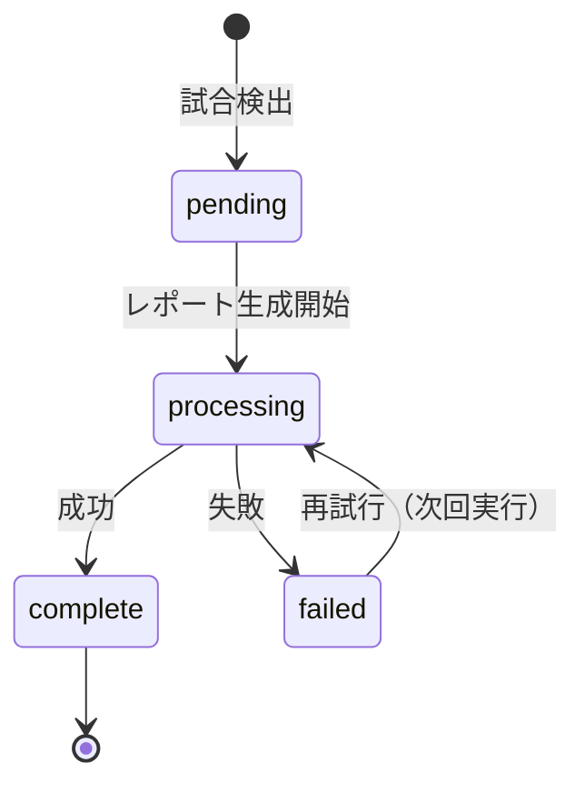

# 試合選定とスケジュール管理 (Match Selection & Scheduling)

## 概要

本システムでは、3時間ごとの定期実行において、**「どの試合をレポート生成対象とするか」**を以下の2つのコンポーネントで決定・管理します。

1. **Match Selector**: 優先度に基づく試合の選定（最大5試合）
2. **Match Scheduler**: 時間枠と処理状態に基づく実行管理

---

## 1. 試合選定ロジック (Match Selection Logic)

`MatchSelector` は、取得した全試合の中から、レポート生成対象とする試合を最大数（`config.MATCH_LIMIT` = 5）まで選定します。

### 1.1 ランク判定と優先順位

各試合には優先度ランク（S, A, None）が付与され、**Rank S > Rank A > Rank None** の順で優先的に選定されます。

#### Rank S (最優先)
- **Manchester City**
- **CL Big Teams** (Real Madrid, Barcelona, Bayern, etc. 同士の対戦)

#### Rank A (高優先)
- **主要人気クラブ**:
  - EPL: Arsenal, Chelsea, Brighton, Manchester United, Liverpool, Tottenham, Leeds United
  - La Liga: Barcelona, Real Madrid, Atletico Madrid, Real Sociedad
- **日本人選手所属チーム**:
  - 出場予定の日本人選手（Mitoma, Kubo, Endo, Tomiyasu等）が含まれる場合

#### Rank None (その他)
- 上記以外

### 1.2 同ランク時のタイブレーク

ランクが同じ場合、コンペティションの優先度で順位が決まります：

1. `CL` (Champions League)
2. `LALIGA` (La Liga)
3. `EPL` (Premier League)
4. `COPA` (Copa del Rey)
5. `FA` (FA Cup)
6. `EFL` (Carabao Cup)

> [!NOTE]
> `LALIGA > EPL` の設定により、ランク外の試合同士ではラ・リーガの試合（例: Osasuna vs Celta）がプレミアリーグ（例: Aston Villa vs Fulham）より優先されます。

### 1.3 選定プロセス

1. 全候補試合をランク順（S > A > None）、次いでコンペティション順にソート。
2. 上位から順に `MATCH_LIMIT`（本番: 5試合）に達するまで選定。
3. 選定された試合のみ `is_target=True` となり、レポート生成プロセスへ進みます。

---

## 2. スケジュール管理 (Match Scheduler)

選定された試合に対して、**「今、レポートを生成すべきか」**を判定します。

### 2.1 時間ウィンドウ判定

以下の時間帯に含まれる試合のみを処理対象とします。

```
キックオフ 1時間前  <=  現在時刻  <=  キックオフ 24時間後
```

- **目的**: 試合直前から試合終了後までをカバーし、かつGitHub Actionsの実行タイミング（3時間ごと）や失敗時の再試行を考慮して、広めの24時間を設定しています。

### 2.2 処理ステータス管理 (FixtureStatusManager)

時間枠内の試合であっても、重複実行を防ぐため、**Fixture単位のステータス管理**を行います。
状態は GCS (`gs://{bucket}/schedule/fixture_status.csv`) で永続化されます。

#### ステータス遷移図



#### 判定ルール

1. **未処理 (No Record)**:
   - 処理対象とする (`processing` へ遷移)

2. **完了済み (complete)**:
   - **スキップする** (再実行しない)

3. **失敗 (failed)**:
   - 再試行回数が3回未満なら、**再試行する** (`processing` へ遷移)
   - 3回以上失敗していれば、スキップする

---

## 3. コンポーネント構成

```
src/
├── domain/
│   ├── match_selector.py     # 試合選定ロジック (Rank判定)
│   └── match_ranker.py       # チーム/選手に基づくランク付け
├── utils/
│   ├── match_scheduler.py    # 時間枠判定とフィルタリング
│   └── fixture_status_manager.py # GCSステータス管理
└── workflows/
    └── generate_guide_workflow.py # 実行オーケストレーション
```
