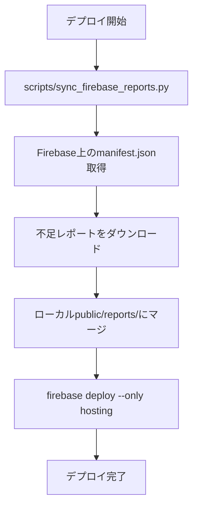
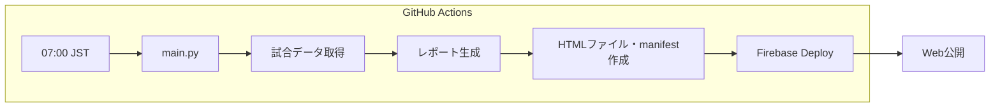
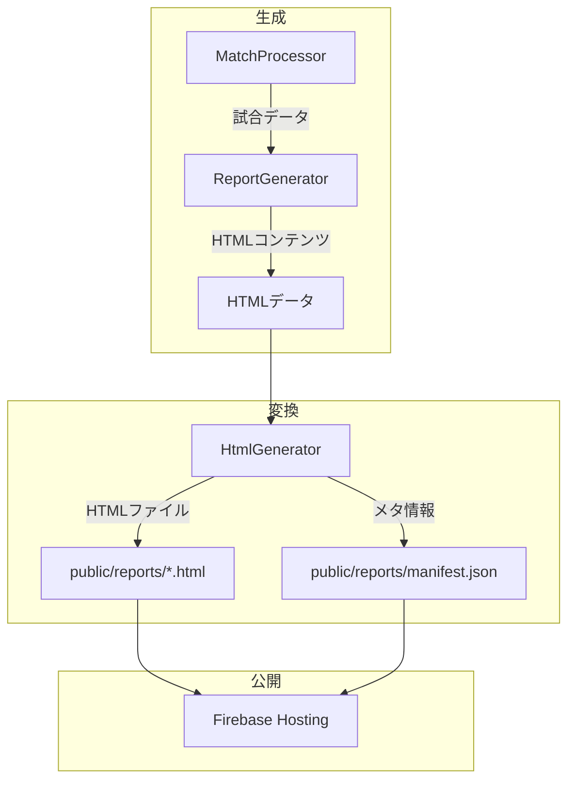

# デプロイ設計書

## 概要

Firebase Hosting へのデプロイ方法と注意事項をまとめたドキュメント。

---

## デプロイ方式

| 方式 | 説明 | 実行者 |
|------|------|--------|
| **GitHub Actions** | 毎日07:00 JST に自動実行 | 自動 |
| **ローカル** | 手動でデプロイ | 開発者 |
| **debug-run ワークフロー** | デバッグ実行後にデプロイ | 開発者（AIアシスタント） |

---

## ⚠️ 重要な注意事項

### 1. Firebase Hosting の上書き動作

> [!CAUTION]
> `firebase deploy --only hosting` は **ローカルの `public/` で Firebase を完全に上書き**する。
> ローカルに存在しないファイルは **Firebase 上から削除される**。

### 2. レポート紛失の防止

GitHub Actions で生成されたレポートはローカルに存在しない場合がある。

**必ずデプロイ前に同期スクリプトを実行すること:**

```bash
python scripts/sync_firebase_reports.py
firebase deploy --only hosting
```

---

## デプロイフロー



---

## ローカルデプロイ手順

### 1. 前提条件

- Firebase CLI がインストール済み (`firebase --version`)
- Firebase プロジェクトにログイン済み (`firebase login`)

### 2. 同期 → デプロイ

```bash
# 1. Firebaseからレポートを同期
python scripts/sync_firebase_reports.py

# 2. デプロイ
firebase deploy --only hosting
```

### 3. 確認

```bash
open https://football-delay-watching-a8830.web.app
```

---

## デバッグ/モックモードでのデプロイ

ローカルでデバッグやモックモードを実行した後は、**必ず同期→デプロイを行うこと**。

### 実行モード

> 詳細は [実行モード設計書](./execution_mode.md) を参照。

| モード | コマンド | 用途 |
|--------|---------|------|
| **モック** | `DEBUG_MODE=True USE_MOCK_DATA=True python main.py` | UIレイアウト確認 |
| **デバッグ** | `DEBUG_MODE=True USE_MOCK_DATA=False python main.py` | 機能の動作確認 |

### 実行後のデプロイ

```bash
# 同期 + デプロイ（必ずセットで実行）
source ~/.zshrc && python scripts/sync_firebase_reports.py && firebase deploy --only hosting
```

> [!WARNING]
> デプロイを忘れると、生成したレポートはローカルにのみ存在し、Webで確認できない。

### /debug-run ワークフロー

AIアシスタント向けに `.agent/workflows/debug-run.md` を用意。
実行→デプロイまで自動で行う。

---

## GitHub Actions デプロイ

`.github/workflows/daily_report.yml` で自動実行。

### 処理内容

1. レポート生成 (`python main.py`)
2. `public/` に HTML コピー
3. 設定ファイル生成 (firebase_config.json, allowed_emails.json)
4. `firebase deploy --only hosting`

### 注意

GitHub Actions ではローカルに新しいレポートを生成してからデプロイするため、
Firebase 上の既存レポートは Actions 実行時に保持される。

---

## ファイル構成

```
public/
├── index.html              ← ログイン + レポート一覧
├── firebase_config.json    ← Firebase設定（環境変数から生成）
├── allowed_emails.json     ← 許可メールリスト（環境変数から生成）
└── reports/
    ├── manifest.json       ← レポート一覧データ
    ├── report_*.html       ← 各レポート
    └── images/             ← フォーメーション図
```

---

## トラブルシューティング

### レポートが消えた場合

1. Firebase Hosting の履歴からロールバック可能
2. または GCS キャッシュから復元

```bash
# Firebase Hosting の履歴確認
firebase hosting:releases:list --limit 10
```

### 認証エラー

```bash
# 再ログイン
firebase logout
firebase login
```

---

## バッチ実行フロー

### 実行タイミング

| 項目 | 内容 |
|------|------|
| **実行時刻** | 毎日 07:00 JST（22:00 UTC） |
| **対象試合** | 前日 07:00 JST ～ 当日 07:00 JST にキックオフ |
| **対象リーグ** | EPL / Champions League |
| **試合上限** | 最大3試合（`Config.MATCH_LIMIT`） |

### 処理フロー



---

## 生成物ライフサイクル

### 生成物の流れ



### ファイル保存場所

| 生成物 | パス | 保持期間 |
|--------|------|----------|
| HTML | `public/reports/*.html` | Firebase上で永続 |
| 画像 | `public/reports/images/` | Firebase上で永続 |
| manifest | `public/reports/manifest.json` | 最新に上書き |

> [!IMPORTANT]
> Firebase Hosting はデプロイ時に `public/` を完全上書き。
> ローカルにないファイルは Firebase 上から削除される。
> 詳細は[レポート紛失の防止](#2-レポート紛失の防止)を参照。

---

## 失敗時の対応

### 一次確認ポイント

| 確認項目 | 方法 |
|----------|------|
| **Actions実行結果** | [GitHub Actions](https://github.com/igrekplus/football-delay-watching/actions) でログ確認 |
| **APIクォータ** | [api_quota.md](./api_quota.md) のヘルスチェックスクリプト実行 |
| **試合データ** | 対象時間帯に試合がなかった可能性を確認 |

### 再実行方法

| 方法 | コマンド / 手順 |
|------|----------------|
| **GitHub Actions 手動実行** | Actions → `Daily Soccer Viewing Guide` → `Run workflow` |
| **ローカル再実行** | `DEBUG_MODE=True python main.py` → `firebase deploy` |

### 依存APIの確認先

各APIのステータス確認方法は [api_quota.md](./api_quota.md) を参照。

```bash
# 一括確認
python healthcheck/check_football_api.py
python healthcheck/check_google_search.py
python healthcheck/check_gemini.py
python healthcheck/check_gmail.py
```

---

最終更新: 2025-12-31
