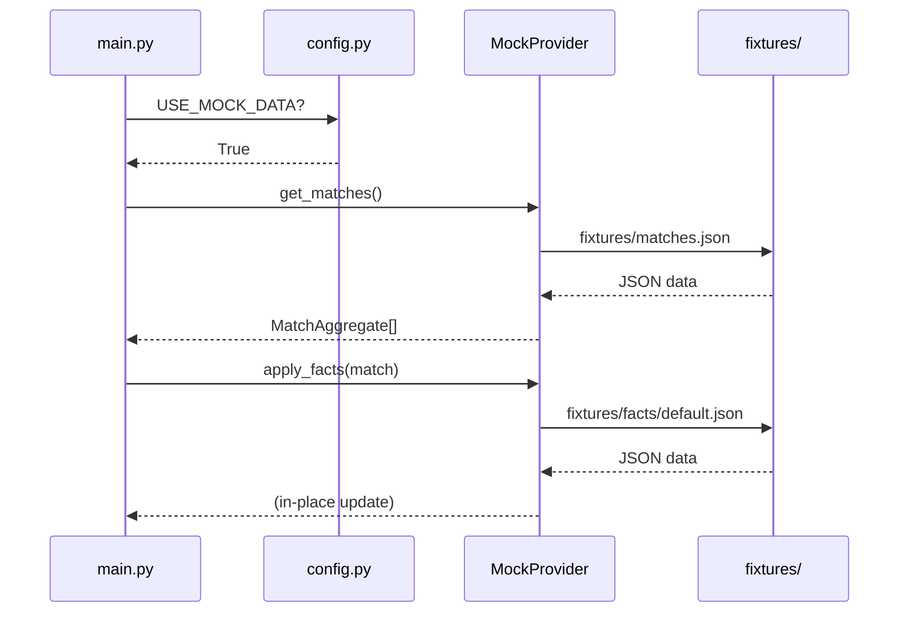

# 実行モード設計

本ドキュメントは、アプリケーションの実行モード（本番・デバッグ・モック）、環境変数、時間ウィンドウ計算、MockProviderの仕様を一元化する。

---

## 1. 環境変数一覧

| 変数名 | デフォルト | 説明 |
|--------|-----------|------|
| `DEBUG_MODE` | `False` | デバッグモード有効化 |
| `TARGET_DATE` | なし | 処理対象日 (YYYY-MM-DD) ※翌日指定 |
| `USE_MOCK_DATA` | `False` | モックデータ使用 |
| `USE_API_CACHE` | （自動判定） | キャッシュ有効化 |
| `CACHE_BACKEND` | `gcs` | `local` or `gcs` |
| `GCS_CACHE_BUCKET` | `football-delay-watching-cache` | GCSバケット名 |

### 環境変数の自動判定ロジック

`USE_API_CACHE` は明示的に設定されていない場合、以下のルールで自動判定される:

```python
# config.py より
if self._USE_API_CACHE_OVERRIDE is not None:
    return self._USE_API_CACHE_OVERRIDE.lower() == "true"
# Default: enable cache in debug mode with real API
return self.DEBUG_MODE and not self.USE_MOCK_DATA
```

---

## 2. モード別動作差分表

| 項目 | 本番 (Actions) | デバッグ (ローカル) | モック |
|------|---------------|-------------------|--------|
| `DEBUG_MODE` | `False` | `True` | `True` |
| `USE_MOCK_DATA` | `False` | `False` | `True` |
| `USE_API_CACHE` | `True` | `True` | `False` |
| API呼び出し | 実API | 実API | なし |
| 試合選定 | 全試合（最大3） | 1試合のみ | 固定3試合 |
| データソース | API/GCS | API/GCS | fixtures/mock_*.json |
| 出力先 | `reports/` | `reports_debug/` | `reports_mock/` |

### 実行コマンド

| モード | コマンド | 用途 |
|--------|---------|------|
| **モック** | `DEBUG_MODE=True USE_MOCK_DATA=True python main.py` | UIレイアウト確認 |
| **デバッグ** | `DEBUG_MODE=True USE_MOCK_DATA=False python main.py` | 機能の動作確認 |
| **本番** | `USE_MOCK_DATA=False python main.py` | バッチ実行 |

> [!WARNING]
> 動作確認時は原則として**デバッグモード（実API）**で実行すること。
> モックモードはUIレイアウトの確認のみに使用する。

---

## 3. 時間ウィンドウ計算

試合データの取得対象期間はモードによって異なる。

### 3.1 計算ロジック

| モード | 対象期間 |
|--------|---------|
| **本番** | `昨日 07:00 JST` ～ `今日 07:00 JST` |
| **デバッグ (デフォルト)** | `現在時刻 - 24時間` ～ `現在時刻` |
| **デバッグ (TARGET_DATE指定)** | `指定日-1日 07:00 JST` ～ `指定日 07:00 JST` |

### 3.2 GitHub Actions スケジュール

| 項目 | 旧 | 新 |
|------|-----|-----|
| cron | `0 22 * * *` (7時固定) | `0 */3 * * *` (3時間毎) |
| 試合なし時 | エラー終了 | 正常終了（スキップ） |

### 3.3 未済管理

レポート作成状況を GCS 上の CSV で管理し、重複処理を防止する。

**保存先**: `gs://football-delay-watching-cache/schedule/report_status.csv`

| カラム | 説明 |
|--------|------|
| `date` | 対象日付 (YYYY-MM-DD) |
| `status` | `pending` / `complete` / `skipped` |
| `processed_at` | 処理完了日時 (ISO8601) |
| `match_count` | 処理した試合数 |

> [!NOTE]
> 直近30日分のみ保持。古いデータは自動削除される。

---

## 4. MockProvider

モックモードでは `MockProvider` クラスがAPIの代わりにデータを提供する。

### 4.1 概要

| 項目 | 値 |
|------|-----|
| 実装ファイル | `src/mock_provider.py` |
| データソース | `fixtures/` ディレクトリ |
| キャッシュ | クラス内にJSONキャッシュ |

### 4.2 fixtures ディレクトリ構造

```
fixtures/
├── matches.json       # 試合一覧（固定3試合）
├── facts/
│   └── default.json   # スタメン、フォーメーション、怪我人情報
├── youtube/
│   └── default.json   # YouTube動画データ
├── news/
│   └── default.json   # ニュース記事データ
└── llm/
    └── default.json   # ニュース要約、戦術プレビュー
```

### 4.3 mock_*.json スキーマ概要

| ファイル | 主なフィールド |
|---------|--------------|
| `matches.json` | `id`, `home_team`, `away_team`, `competition`, `kickoff_jst`, `rank` |
| `facts/default.json` | `venue`, `referee`, `home_formation`, `away_formation`, `home_lineup[]`, `injuries_list[]` |
| `youtube/default.json` | `title`, `url`, `channel`, `published_at`, `thumbnail` |
| `news/default.json` | `title`, `content`, `source`, `url`, `relevance_score` |
| `llm/default.json` | `news_summary`, `tactical_preview` |

### 4.4 モックモードでの使用フロー



---

## 5. 関連ドキュメント

- [キャッシュ設計書](./cache.md) - モード別キャッシュ動作
- [実行基盤設計](./infrastructure.md) - GitHub Actions、時刻処理
- [デプロイプロセス設計書](./deployment_process.md) - デプロイ手順
- [config.py](file:///Users/nagataryou/football-delay-watching/config.py) - 環境変数定義
- [src/mock_provider.py](file:///Users/nagataryou/football-delay-watching/src/mock_provider.py) - MockProvider実装

---

最終更新: 2026-01-02
