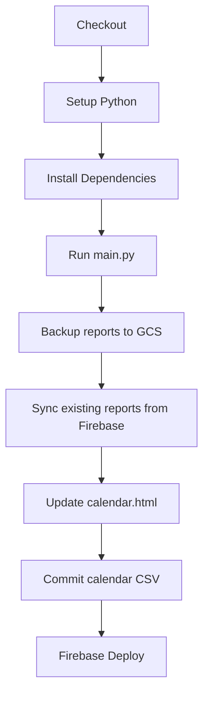

# 実行基盤設計

機能要件全体を実現するための実行基盤（GitHub Actions、時刻処理）の設計。

---

## 1. GitHub Actions

### 1.1 概要

| 項目 | 値 |
|------|-----|
| ワークフロー名 | `daily_report.yml` |
| 実行タイミング | 3時間ごと (`0 */3 * * *` UTC) |
| 手動実行 | `workflow_dispatch` |

### 1.2 処理フロー



1. **Checkout**: リポジトリの最新コードを取得
2. **Setup Python**: Python 3.11 環境を構築
3. **Install Dependencies**: `requirements.txt` からライブラリをインストール
4. **Run Application**: 環境変数を注入して `main.py` を実行
5. **Backup to GCS**: 生成済みレポートをバックアップ
6. **Sync Existing Reports**: Firebase上の既存レポートをローカルへ同期
7. **Update Calendar**: `calendar.html` を再生成
8. **Commit & Push**: `settings/calendar/*.csv` の更新をコミット
9. **Firebase Deploy**: Hostingへデプロイ

### 1.3 環境変数

```yaml
USE_MOCK_DATA: "False"
USE_API_CACHE: "True"
CACHE_BACKEND: "gcs"
GCS_CACHE_BUCKET: "football-delay-watching-cache"
```

---

## 2. 時刻・タイムゾーン処理

### 2.1 環境別タイムゾーン

| 環境 | システム時刻 | 対応 |
|------|-------------|------|
| GitHub Actions | UTC | Pythonコード内で明示的にJST変換 |
| ローカル開発 | JST | 一貫性のためJST明示推奨 |

### 2.2 設計方針

1. **レポートファイル名**: 実行時のJST日付を使用
2. **試合データフィルタ**: 現在時刻基準で「キックオフ1時間前〜24時間後」を対象
3. **Cronスケジュール**: UTC表記 (`0 */3 * * *` = 3時間ごと)

### 2.3 実装パターン

```python
import pytz
from datetime import datetime

# 正しい例
jst = pytz.timezone('Asia/Tokyo')
now_jst = datetime.now(jst)

# 誤った例（GitHub ActionsではUTCになる）
now_utc = datetime.now()  # NG
```

### 2.4 config.TARGET_DATE

`config.TARGET_DATE` は **timezone-aware な datetime オブジェクト** を返す。

本番モードとデバッグモードで計算ロジックが異なる。詳細は [実行モード設計書](./execution_mode.md#3-時間ウィンドウ計算) を参照。

---

## 3. フォーメーション図生成

機能要件「固定情報取得 (Facts)」のフォーメーション図を実現する。

### 3.1 概要

| 項目 | 値 |
|------|-----|
| ライブラリ | Pillow (PIL) |
| 実装 | `src/utils/formation_image.py` |
| 出力先 | `public/reports/images/` |

### 3.2 処理フロー

1. フォーメーション文字列（例: `4-3-3`）をパース
2. ピッチ画像テンプレート上に選手名を配置
3. PNG画像として保存
