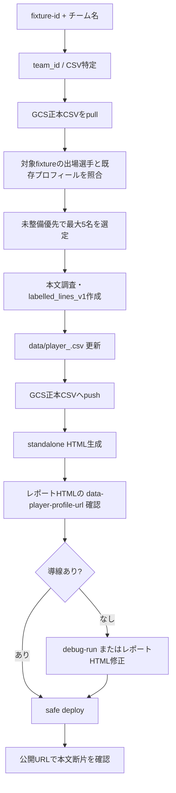

# 選手プロフィール作成運用設計書

## 概要

試合レポート内の選手詳細プロフィールは、対象 fixture と対象チームを起点に、未整備選手を少人数ずつ継続更新する運用として扱う。

この文書は実装計画ではなく、運用として成立させるための設計・責務境界・完了条件を定義する。実際の実行手順は `.agent/skills/generate_player_profiles/SKILL.md` を SSOT とする。

---

## 運用の目的

- レポート閲覧者が、試合前に注目選手の背景・特徴・エピソードを確認できるようにする。
- GCS 上の選手マスタ CSV を正本として、プロフィール本文を継続的に整備する。
- レポート HTML から standalone HTML を fetch する導線を保ち、公開URL上でプロフィールを確認できる状態にする。

---

## 入力と実行単位

| 項目 | 内容 |
|------|------|
| 入力 | `fixture-id`, `チーム名` |
| 1回の更新上限 | 最大5名 |
| 優先対象 | 未整備チーム、未整備選手、先発、注目度の高い選手 |
| 正本 | `gs://.../master/player/player_<team_id>.csv` |
| ローカル作業コピー | `data/player_<team_id>.csv` |
| standalone HTML | `public/player-profiles/<player_id>.html` |
| レポート HTML | `public/reports/*.html` |

5名上限は品質維持のための運用制約である。対象チームに未整備選手が多い場合も、同一実行で6名以上に広げない。

---

## 責務境界

| 領域 | 責務 | SSOT |
|------|------|------|
| 実行手順 | CSV pull、対象選定、CSV push、HTML生成、debug-run、deploy | `.agent/skills/generate_player_profiles/SKILL.md` |
| 本文調査 | 情報源選定、`labelled_lines_v1` 本文、セルフレビュー、`temp/*.md` 出力 | `.agent/skills/research_player_profile_content/SKILL.md` |
| デプロイ | Firebase Hosting の安全な同期・デプロイ | `.agent/workflows/deploy.md`, `docs/04_operations/deployment.md` |
| 運用設計 | 継続運用の目的、責務境界、完了条件 | 本文書 |

---

## データ更新の流れ

---

## 完了条件

1. 更新対象が5名以内である。
2. 対象チームの GCS 正本 CSV を pull してから編集している。
3. 対象 fixture の出場選手と既存プロフィール有無を確認し、未整備選手を優先している。
4. 更新選手の `profile_format` が `labelled_lines_v1` になっている。
5. 更新選手の `profile_detail` に、`経歴::` が重複しない本文が入っている。
6. GCS 正本へ CSV を push している。
7. `public/player-profiles/<player_id>.html` を生成している。
8. 対象レポート HTML に `data-player-profile-url="/player-profiles/<player_id>.html"` が入っているか確認している。
9. 必要に応じて debug-run を行い、レポート側の導線を再生成している。
10. `./scripts/safe_deploy.sh` で Firebase Hosting へ反映している。
11. 公開URL上で `data-player-profile-url` と本文断片を確認している。

---

## レポート導線の注意点

standalone HTML を生成しても、既存レポート側の選手カードに `data-player-profile-url` が空のままなら、公開URLではプロフィールを開けない。

そのため、この運用では「CSV更新」と「standalone HTML生成」だけを完了扱いにしない。対象レポート HTML 側の参照導線を確認し、必要なら debug-run でレポートを再生成する。

---

## 関連ファイル

- `.agent/skills/generate_player_profiles/SKILL.md`
- `.agent/skills/research_player_profile_content/SKILL.md`
- `.agent/workflows/deploy.md`
- `src/workflows/generate_player_profile/`
- `settings/player_instagram.py`
- `data/player_<team_id>.csv`
- `public/player-profiles/`
- `public/reports/`

---

最終更新: 2026-05-03
