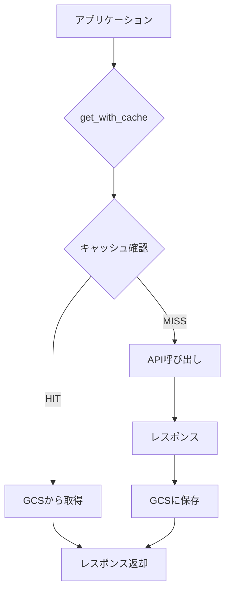

# キャッシュ設計書 (Cache Design Document)

## 1. 概要

外部APIへのリクエスト回数を削減し、クォータ消費を抑制するためのキャッシュ機構。
Google Cloud Storage (GCS) を唯一のバックエンドとして使用する。

### 1.1 目的

| 目的 | 説明 |
|------|------|
| **クォータ節約** | API-Football の日次上限 (100回/日) を効率的に活用 |
| **レスポンス高速化** | 2回目以降のリクエストはGCSから即座に取得 |
| **データ共有** | ローカル開発とGitHub Actionsで同一キャッシュを共有 |

### 1.2 対象API

| API | 実装ファイル | キャッシュ対応 |
|-----|-------------|--------------|
| API-Football | `src/clients/cache.py` | ✅ GCS対応 |
| YouTube Data API | `src/youtube_service.py` | ⚠️ ローカルのみ（別Issue #63 で対応予定） |

---

## 2. アーキテクチャ



### 2.1 環境変数

| 環境変数 | デフォルト | 説明 |
|----------|-----------|------|
| `GCS_CACHE_BUCKET` | `football-delay-watching-cache` | GCSバケット名 |
| `CACHE_BACKEND` | `local` | `local` or `gcs`（将来的に`gcs`をデフォルトに） |
| `USE_API_CACHE` | （自動判定） | キャッシュ有効化フラグ |

### 2.2 キャッシュ有効化条件

```python
# config.py より
USE_API_CACHE = DEBUG_MODE and not USE_MOCK_DATA
```

- **デバッグモード（実API）**: キャッシュ有効
- **本番モード**: キャッシュ有効
- **モックモード**: キャッシュ無効（API呼び出しなし）

---

## 3. ファイル構造

### 3.1 GCSバケット構造

```
gs://football-delay-watching-cache/
├── fixtures/
│   └── {league_id}_{date}_{home}_vs_{away}.json
├── lineups/
│   └── {fixture_id}_{home}_vs_{away}.json
├── players/
│   └── {team_name}/{player_id}.json
├── injuries/
│   └── {fixture_id}.json
├── statistics/
│   └── {team_name}_{season}_{league_id}.json
└── headtohead/
    └── {team1}_vs_{team2}.json
```

### 3.2 ファイル命名規則

| エンドポイント | パターン | 例 |
|--------------|---------|-----|
| `/fixtures` | `fixtures/{league_id}_{date}_{home}_vs_{away}.json` | `fixtures/39_2024-12-21_ManCity_vs_WestHam.json` |
| `/fixtures/lineups` | `lineups/{fixture_id}_{home}_vs_{away}.json` | `lineups/1234567_ManCity_vs_WestHam.json` |
| `/players` | `players/{team_name}/{player_id}.json` | `players/Manchester_City/123.json` |
| `/injuries` | `injuries/{fixture_id}.json` | `injuries/1234567.json` |
| `/teams/statistics` | `statistics/{team_name}_{season}_{league_id}.json` | `statistics/Manchester_City_2024_39.json` |
| `/fixtures/headtohead` | `headtohead/{team1}_vs_{team2}.json` | `headtohead/ManCity_vs_Arsenal.json` |

> **Note**: チーム名はアルファベット順でソートして一意性を保証（headtohead）

---

## 4. TTL方針（キャッシュ有効期限）

| データ種別 | TTL | 理由 |
|-----------|-----|------|
| **選手データ** (`/players`) | 無期限 | 国籍、ポジション等は年単位で不変 |
| **スタメン** (`/lineups`) | 無期限 | 試合後は確定データ |
| **試合一覧** (`/fixtures`) | 10日間 | 開発中の連続実行に対応、日程変更は稀 |
| **過去対戦** (`/headtohead`) | 10日間 | 試合後に内容が変わるため期限あり |
| **チーム統計** (`/statistics`) | 10日間 | リーグ進行で更新されるが開発中は同一データ使用 |
| **負傷者** (`/injuries`) | キャッシュしない | 当日変動あり |

### 4.1 TTLチェック実装状況

| キャッシュ | TTLチェック | 備考 |
|-----------|------------|------|
| API-Football (`cache.py`) | ⚠️ **未実装** | Phase 3で実装予定 |
| YouTube (`youtube_service.py`) | ✅ 実装済み | 1週間TTL |

---

## 5. エンドポイント別詳細

### 5.1 `/teams/statistics` - チーム統計

| レスポンス項目 | 説明 | 現在の利用状況 |
|--------------|------|---------------|
| `form` | 直近試合結果（例: `"LLWLLDLLLWWDLDDLL"`） | ✅ 使用中（最後5文字を抽出） |
| `fixtures.played/wins/draws/loses` | 試合数・勝敗数 | ❌ 未使用 |
| `goals.for/against` | 得点・失点（総数、平均、時間帯別） | ❌ 未使用 |

### 5.2 `/fixtures/headtohead` - 過去対戦

| パラメータ | 値 | 説明 |
|-----------|-----|------|
| `h2h` | `{team1_id}-{team2_id}` | チームIDのペア |
| `last` | `5` | 過去5試合を取得 |

> **Note**: 試合後に過去対戦データの内容が変わるため、TTLは10日間に設定

### 5.3 キャッシュ推奨/非推奨

**推奨**:
- `/players` - 国籍、ポジション等は静的
- `/fixtures/lineups` - 試合後は確定

**非推奨**:
- `/injuries` - 試合当日に変動する可能性あり

---

## 6. キャッシュウォーミング

APIクォータに余裕がある平日に、上位チームの選手データを事前取得する機能。

### 6.1 設定

| 設定項目 | 値 |
|---------|-----|
| 実装ファイル | `src/cache_warmer.py` |
| 対象チーム | EPL上位10チーム + CL上位13チーム |
| 実行条件 | 残クォータ > 30、09:00 JST前 |
| 環境変数 | `CACHE_WARMING_ENABLED` (デフォルト: False) |

### 6.2 対象チーム一覧

**EPL上位10チーム** (`config.EPL_CACHE_TEAMS`):
- Liverpool, Chelsea, Arsenal, Nottingham Forest, Brighton
- Manchester City, Bournemouth, Newcastle, Aston Villa, Fulham

**CL上位13チーム** (`config.CL_CACHE_TEAMS`):
- Liverpool, Barcelona, Arsenal, Inter, Bayer Leverkusen
- Atletico Madrid, AC Milan, Atalanta, Monaco, Sporting CP
- Bayern Munich, Borussia Dortmund, Real Madrid

---

## 7. 実装詳細

### 7.1 主要関数

```python
# src/clients/cache.py

def get_with_cache(
    url: str,
    headers: Dict[str, str],
    params: Dict[str, Any] = None,
    team_name: str = None
) -> requests.Response:
    """
    キャッシュ機能付きのGETリクエスト
    
    Args:
        url: APIエンドポイントURL
        headers: リクエストヘッダー
        params: クエリパラメータ
        team_name: チーム名（playersエンドポイント用）
    
    Returns:
        requests.Response または CachedResponse
    """
```

### 7.2 CachedResponseクラス

キャッシュから読み込んだデータを `requests.Response` と同じインターフェースで扱うためのラッパー。

```python
class CachedResponse:
    status_code = 200
    ok = True
    
    def json(self) -> dict: ...
    def raise_for_status(self) -> None: ...
```

---

## 8. 確認コマンド

```bash
# GCSキャッシュ状況の確認
python healthcheck/check_gcs_cache.py

# API-Footballクォータ確認
python healthcheck/check_football_api.py
```

---

## 9. 関連ドキュメント

- [システム設計書](system_design.md) - 全体アーキテクチャ
- [API-Football エンドポイント詳細](api_endpoints.md) - 各エンドポイントのパラメータ
