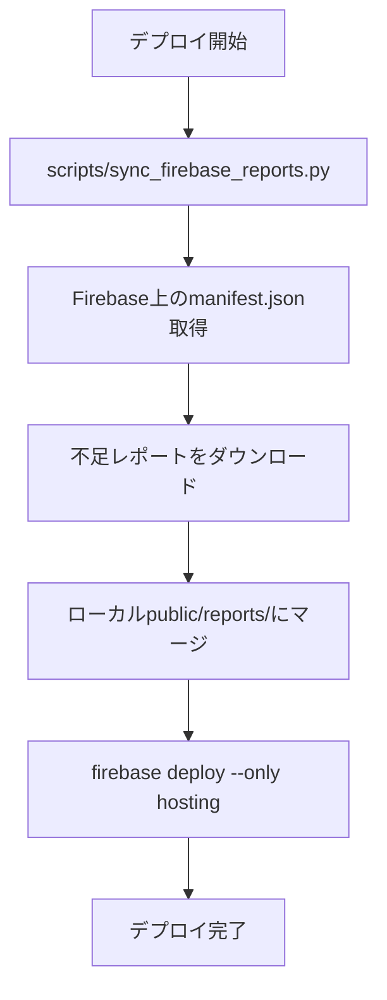

# デプロイ設計書

## 概要

Firebase Hosting へのデプロイ方法と注意事項をまとめたドキュメント。

---

## デプロイ方式

| 方式 | 説明 | 実行者 |
|------|------|--------|
| **GitHub Actions** | 毎日07:00 JST に自動実行 | 自動 |
| **ローカル** | 手動でデプロイ | 開発者 |
| **debug-run ワークフロー** | デバッグ実行後にデプロイ | 開発者（AIアシスタント） |

---

## ⚠️ 重要な注意事項

### 1. Firebase Hosting の上書き動作

> [!CAUTION]
> `firebase deploy --only hosting` は **ローカルの `public/` で Firebase を完全に上書き**する。
> ローカルに存在しないファイルは **Firebase 上から削除される**。

### 2. レポート紛失の防止

GitHub Actions で生成されたレポートはローカルに存在しない場合がある。

**必ずデプロイ前に同期スクリプトを実行すること:**

```bash
python scripts/sync_firebase_reports.py
firebase deploy --only hosting
```

---

## デプロイフロー



---

## ローカルデプロイ手順

### 1. 前提条件

- Firebase CLI がインストール済み (`firebase --version`)
- Firebase プロジェクトにログイン済み (`firebase login`)

### 2. 同期 → デプロイ

```bash
# 1. Firebaseからレポートを同期
python scripts/sync_firebase_reports.py

# 2. デプロイ
firebase deploy --only hosting
```

### 3. 確認

```bash
open https://football-delay-watching-a8830.web.app
```

---

## GitHub Actions デプロイ

`.github/workflows/daily_report.yml` で自動実行。

### 処理内容

1. レポート生成 (`python main.py`)
2. `public/` に HTML コピー
3. 設定ファイル生成 (firebase_config.json, allowed_emails.json)
4. `firebase deploy --only hosting`

### 注意

GitHub Actions ではローカルに新しいレポートを生成してからデプロイするため、
Firebase 上の既存レポートは Actions 実行時に保持される。

---

## ファイル構成

```
public/
├── index.html              ← ログイン + レポート一覧
├── firebase_config.json    ← Firebase設定（環境変数から生成）
├── allowed_emails.json     ← 許可メールリスト（環境変数から生成）
└── reports/
    ├── manifest.json       ← レポート一覧データ
    ├── report_*.html       ← 各レポート
    └── images/             ← フォーメーション図
```

---

## トラブルシューティング

### レポートが消えた場合

1. Firebase Hosting の履歴からロールバック可能
2. または GCS キャッシュから復元

```bash
# Firebase Hosting の履歴確認
firebase hosting:releases:list --limit 10
```

### 認証エラー

```bash
# 再ログイン
firebase logout
firebase login
```
