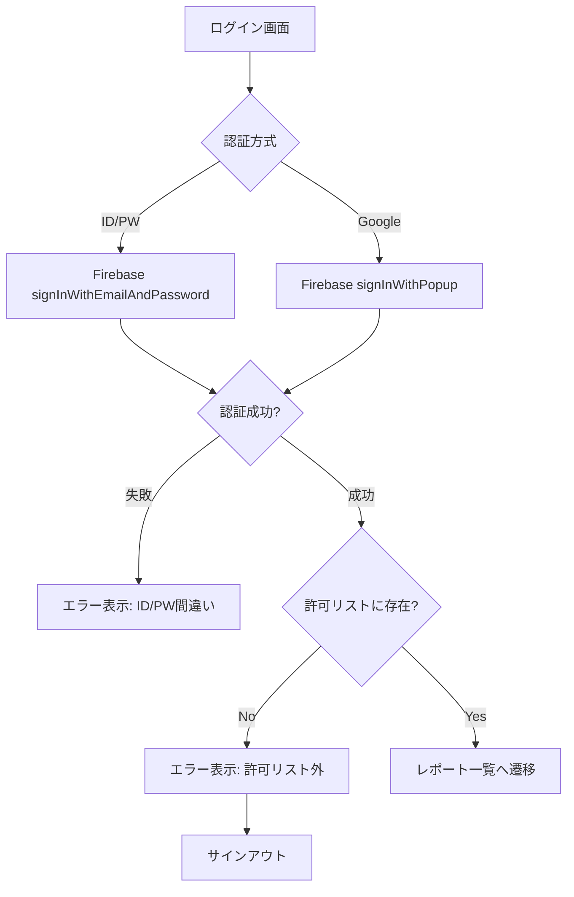

# ログイン機能 要件・設計書

## 1. 要件

### 1.1 認証方式

| 方式 | 説明 | 用途 |
|------|------|------|
| ID/PW認証 | メールアドレス+パスワードでログイン | テスト・開発用（管理者のみ発行可能） |
| Google OAuth | Googleアカウントでログイン | 本運用向け（許可リスト制御） |

### 1.2 認可ルール

- **許可リスト制御**: `allowed_emails.json` に登録されたメールアドレスのみアクセス可能
- 管理者が許可リストを編集 → デプロイで反映

### 1.3 エラーメッセージ

| ケース | メッセージ |
|--------|-----------|
| ID/PW間違い | 「メールアドレスまたはパスワードが間違っています」 |
| OAuth許可リスト外 | 「このアカウントは許可リストに登録されていません」 |

### 1.4 ログイン後の遷移

- ログイン成功 → 「ログイン成功！」表示 → レポート一覧画面へ遷移

---

## 2. 技術設計

### 2.1 使用技術

- **Firebase Authentication**
  - Email/Password Provider
  - Google Provider
- **認可チェック**: クライアント側で `allowed_emails.json` と照合

### 2.2 ファイル構成

```
public/
├── index.html           # ログイン画面 + レポート一覧
├── allowed_emails.json  # 許可メールアドレスリスト
└── firebase_config.json # Firebase設定
```

### 2.3 認証フロー



### 2.4 allowed_emails.json 形式

```json
{
    "emails": [
        "nakame.kate@gmail.com",
        "sampleexample@gmail.com"
    ]
}
```

---

## 3. UI設計

### 3.1 ログイン画面

```
┌─────────────────────────────────┐
│      ⚽ サッカー観戦ガイド        │
│                                 │
│  ┌───────────────────────────┐  │
│  │  メールアドレス            │  │
│  │  [                    ]   │  │
│  │  パスワード               │  │
│  │  [                    ]   │  │
│  │  [🔐 ログイン]            │  │
│  │                           │  │
│  │  ─────── または ───────   │  │
│  │                           │  │
│  │  [G Googleでログイン]     │  │
│  │                           │  │
│  │  エラーメッセージ表示欄    │  │
│  └───────────────────────────┘  │
└─────────────────────────────────┘
```

### 3.2 エラー表示

- **赤色テキスト**で表示
- ログインボタンの下に配置

---

## 4. Firebase Console 設定

### 4.1 必要な設定

1. **Authentication → Sign-in method**
   - Email/Password: 有効
   - Google: 有効

2. **Authorized domains**
   - `football-delay-watching-a8830.web.app`
   - `localhost`（開発用）

### 4.2 テストユーザー作成

Firebase Console → Authentication → Users でメール/パスワードユーザーを手動作成
