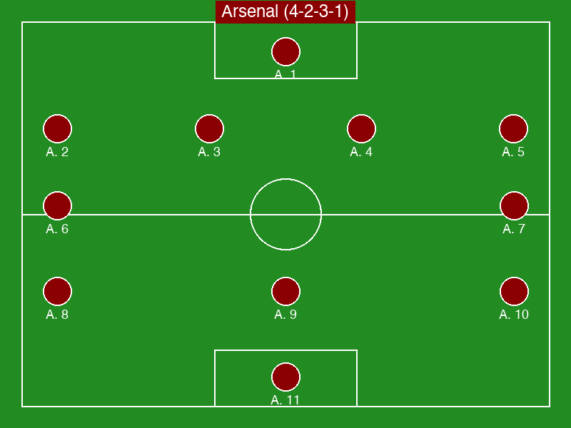

# 本日の対象試合（1件）

1. Manchester City vs Arsenal （EPL／Absolute）

## 試合1：Manchester City vs Arsenal （EPL／Absolute）

### ■ 基本情報（固定情報）
- 大会：EPL
- 日時：2025/05/01 04:00 JST / 2025/04/30 20:00 GMT
- 会場：Etihad Stadium, Manchester
- スタメン（Manchester City）：
    - GK: Home Player 1 🏴󠁧󠁢󠁥󠁮󠁧󠁿
    - DF: Home Player 2 🇵🇹, Home Player 3 🇧🇪, Home Player 4 🏴󠁧󠁢󠁥󠁮󠁧󠁿, Home Player 5 🇳🇴
    - MF: Home Player 6 🇪🇸, Home Player 7 🇩🇪, Home Player 8 🏴󠁧󠁢󠁥󠁮󠁧󠁿
    - FW: Home Player 9 🇧🇷, Home Player 10 🇦🇷, Home Player 11 🏴󠁧󠁢󠁥󠁮󠁧󠁿
- スタメン（Arsenal）：
    - GK: Away Player 1 🇪🇸
    - DF: Away Player 2 🇫🇷, Away Player 3 🇧🇷, Away Player 4 🏴󠁧󠁢󠁥󠁮󠁧󠁿, Away Player 5 🇯🇵
    - MF: Away Player 6 🇬🇭, Away Player 7 🇳🇴
    - FW: Away Player 8 🏴󠁧󠁢󠁥󠁮󠁧󠁿, Away Player 9 🇳🇬, Away Player 10 🇫🇷
    - FW: Away Player 11 🏴󠁧󠁢󠁥󠁮󠁧󠁿
- ベンチ（Home）：Home Sub 1, Home Sub 2, Home Sub 3, Home Sub 4, Home Sub 5, Home Sub 6, Home Sub 7
- ベンチ（Away）：Away Sub 1, Away Sub 2, Away Sub 3, Away Sub 4, Away Sub 5, Away Sub 6, Away Sub 7
- フォーメーション：Home 4-3-3 / Away 4-2-3-1
- 出場停止・負傷者情報：Player A(Home): ハムストリング, Player B(Away): 出場停止
- 直近フォーム：Home W-W-D-W-W / Away L-D-W-L-D
- 過去の対戦成績：過去5試合: Home 2勝, 引分 1, Away 2勝
- 主審：Michael Oliver

### ■ フォーメーション図

### ■ ニュース要約（600〜1,000字）
- SUMMARY for Manchester City vs Arsenal: Guardiola says Arsenal is tough. Key player X returned. (Mock Summary)

**Sources:**
- mock-sports.com: Pep Talk
- mock-news.net: Injury Update

### ■ 戦術プレビュー
- TACTICAL PREVIEW: Manchester City vs Arsenal (Mock Preview)
- URL: https://example.com/tactical-preview

### ■ 監督・選手コメント
- 【Manchester City】監督: 『重要な試合になる。選手たちは準備できている。』
- 【Arsenal】監督: 『難しいアウェイ戦だが、勝ち点3を持ち帰りたい。』

### ■ エラーステータス
- Normal

## 選外試合リスト

- Real Madrid vs Bayern Munich （CL）… Out of quota
- Barcelona vs PSG （CL）… Out of quota
- Brighton vs Liverpool （EPL）… Out of quota
- Crystal Palace vs Fulham （EPL）… Low rank

## API使用状況
- API-Football: (キャッシュから取得のため情報なし)
- Google Custom Search API: Check Cloud Console (Quota: 100/day free)

---
*レポート生成日時: 2025-12-16 22:17:31 JST*